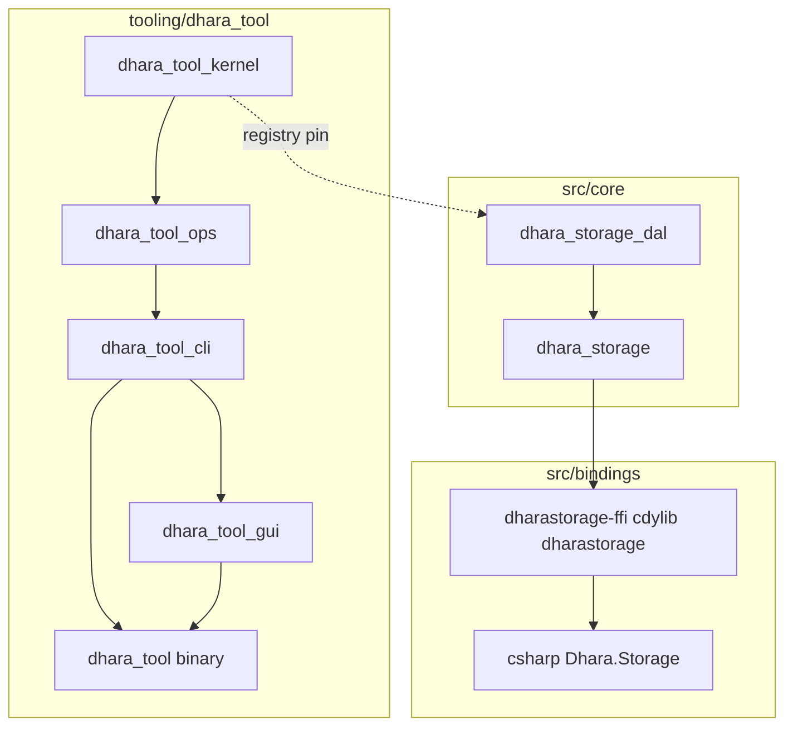

# Dhara Storage — workspace architecture

This document maps how the monorepo is organized after the tool-focused modularization pass: crate boundaries, operator-tool layering, bindings layout, publish pipelines, and how the tool couples to `dhara_storage_dal` at compile time versus at release time.

## Repository layout

| Path | Role |
|------|------|
| `src/core/dhara_storage_dal` | FlatBuffers DAL; embeds `filedefs.dat` |
| `src/core/dhara_storage` | Rust-native runtime (crates.io) |
| `src/bindings/dharastorage-ffi` | C ABI crate (`dharastorage-ffi` package, `dharastorage` lib name) |
| `src/bindings/csharp/` | `Dhara.Storage` NuGet source, tests, consumer smoke |
| `tooling/dhara_tool/crates/*` | Nested workspace: kernel → ops → cli/gui → binary |
| `dhara.config.toml` | Workspace semver, tool semver, NuGet/CI metadata |

## Operator tool crates

The operator surface is a **nested Cargo workspace** under `tooling/dhara_tool/`. Version authority for the tool is `[workspace.package].version` in `tooling/dhara_tool/Cargo.toml`, pinned in CI via `[tool].version` in `dhara.config.toml`.

```mermaid
flowchart LR
  subgraph kernel [dhara_tool_kernel]
    paths[paths]
    config[repo_config / activation]
    logging[logging]
    runtime_mod[subprocess / workers]
    defs[filedefs]
    ctx[ToolContext / CommandResult]
  end

  subgraph ops [dhara_tool_ops]
    quality[quality]
    verify[verify]
    release[release]
    nuget[nuget]
    native[native_merge / native_rids]
  end

  subgraph cli [dhara_tool_cli]
    commands[commands / registry]
    forms[forms]
    runner[runner]
  end

  subgraph gui [dhara_tool_gui]
    widgets[widgets / panels]
    screens[screens / app]
  end

  kernel --> ops
  kernel --> cli
  ops --> cli
  cli --> gui
  cli --> bin[dhara_tool bin]
  gui --> bin
```

### Commands vs operations

| Layer | Responsibility | Example |
|-------|----------------|---------|
| **CLI** (`dhara_tool_cli`) | Arg parsing, command registry, dispatch, form schemas | `version show`, `quality clippy` argv → handler |
| **Ops** (`dhara_tool_ops`) | Domain workflows shared by CLI and GUI | `quality::run_clippy`, `release::run_cargo_release` |
| **Kernel** (`dhara_tool_kernel`) | Paths, config activation, logging, defs I/O, subprocess helpers | `detect_config_drift`, `defs sync-embedded` |

**Version bump example:** `version bump patch` in CLI calls `repo_config::bump_workspace_version` in kernel, which writes `dhara.config.toml` and (on activation) syncs root `Cargo.toml` workspace deps. Tool-only bumps update `[tool].version` and `tooling/dhara_tool/Cargo.toml` `[workspace.package].version` together.

`app.rs` lives in the **binary crate** because it orchestrates CLI and GUI; neither `cli` nor `gui` can depend on each other without a cycle.

### GUI widget tiers

| Tier | Location | When to use |
|------|----------|-------------|
| **Primitives** | `gui/widgets/` — `Panel`, `Field`, `Stepper`, tree row chrome | Reusable visual/interaction building blocks |
| **Screens** | `gui/screens/` or top-level `gui/app.rs` | Compose primitives into a full view |
| **Promotion** | Move to `widgets/` when used twice+ or >~80 lines of shared layout | Avoid premature abstraction |

Primitives stay **iced-first** (no business logic); screens call into `dhara_tool_ops` via `ToolContext` and `dhara_tool_cli::runner`.

## Path resolution and config

`dhara_tool` separates **exe_path** (directory of the running binary) from **repo_path** (directory containing `dhara.config.toml`).

| Anchor | Resolution | Outputs |
|--------|------------|---------|
| `exe_path` | `resolve_exe_root(current_exe)` | `logs/`, `output/`, `artifacts/`, `runtime.toml` |
| `repo_path` | `-r` / `--repository`, then `runtime.toml`, then prompt or GUI picker | `filedefs.dat`, Cargo/dotnet sources, config activation |

`is_repo_root` requires only `dhara.config.toml`. `-r` accepts a repository directory or a direct path to that file.

`ToolContext` carries `repo_root`, `tool_root` (`exe_path`), activated `DharaRepoConfig`, and logging handles. CLI and GUI construct it once per invocation after repository resolution; ops functions take `&ToolContext` or explicit paths derived from it.

## Publish pipelines (ops)

Release logic in `dhara_tool_ops::release` splits cleanly for CI:

| Workflow | Ops entry | Flags |
|----------|-----------|-------|
| `publish-crates.yml` | `release run` | `--skip-nuget` |
| `publish-nuget.yml` | `release run` | `--skip-cargo --prepacked-nuget <path>` |

PR CI (`pipeline.yml`) still produces `release-native-stage` and `release-nuget-package` artifacts; merge publishes download them at `HEAD^2` (merge second parent).

## Tool ↔ DAL coupling

| Concern | Mechanism |
|---------|-----------|
| **Compile-time DAL** | `dhara_tool_kernel` pins `dhara_storage_dal = { version = "0.9.0" }` from crates.io |
| **Local co-dev** | Root `[patch.crates-io] dhara_storage_dal = { path = "src/core/dhara_storage_dal" }` only |
| **Embedded defs bytes** | `defs sync-embedded` writes git-tracked `resources/filedefs.dat` — data path, not a path dependency |
| **Package version read** | `defs_package_version()` uses `dhara_storage_dal::PACKAGE_VERSION` from the linked crate |

| Artifact | Version authority | Typical bump |
|----------|-------------------|--------------|
| `dhara_storage` / `_dal` | `[versions].workspace` in `dhara.config.toml` | Minor release |
| `dhara_tool` | `[tool].version` + `tooling/dhara_tool/Cargo.toml` | Independent tool releases |
| Tool's `dhara_storage_dal` dep | Semver pin in `dhara_tool_kernel/Cargo.toml` | Patch when publishing hotfix DAL |

CI `dhara-tool-build` resolves DAL from the registry (patch applies only in full workspace builds on developer machines).

## Related docs

- [CI/CD pipelines][ci-cd] — four-workflow map and path filters
- [filedefs.dat format][filedefs-dat]
- [Typed C-compatible ABI][typed-abi]
- [Native packaging][native-packaging]

[ci-cd]: ci-cd-pipelines.md
[filedefs-dat]: filedefs-dat.md
[typed-abi]: typed-c-compatible-abi.md
[native-packaging]: native-packaging.md
