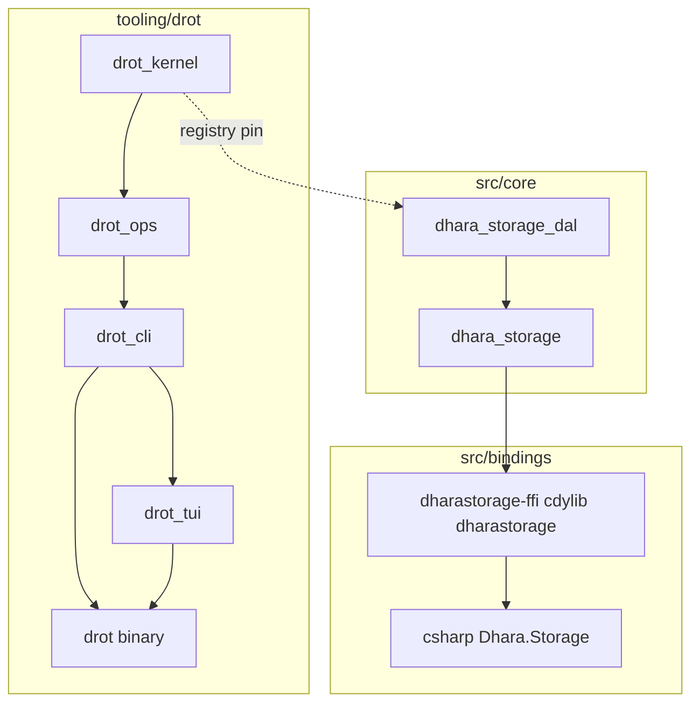

# Dhara Storage — workspace architecture

This document maps how the monorepo is organized after the tool-focused modularization pass: crate boundaries, operator-tool layering, bindings layout, publish pipelines, and how the tool couples to `dhara_storage_dal` at compile time versus at release time.

## Repository layout

```mermaid
flowchart TB
  subgraph core [src/core]
    dal[dhara_storage_dal]
    runtime[dhara_storage]
  end

  subgraph bindings [src/bindings]
    ffi[dharastorage-ffi cdylib dharastorage]
    csharp[csharp Dhara.Storage]
  end

  subgraph tool [tooling/drot]
    kernel[drot_kernel]
    ops[drot_ops]
    cli[drot_cli]
    tui[drot_tui]
    bin[drot binary]
  end

  dal --> runtime
  runtime --> ffi
  ffi --> csharp
  kernel --> ops
  ops --> cli
  cli --> tui
  cli --> bin
  tui --> bin
  kernel -.->|registry pin| dal
```

| Path | Role |
|------|------|
| `src/core/dhara_storage_dal` | FlatBuffers DAL; embeds `filedefs.dat` |
| `src/core/dhara_storage` | Rust-native runtime (crates.io) |
| `src/bindings/dharastorage-ffi` | C ABI crate (`dharastorage-ffi` package, `dharastorage` lib name) |
| `src/bindings/csharp/` | `Dhara.Storage` NuGet source, tests, consumer smoke |
| `tooling/drot/crates/*` | Nested workspace: kernel → ops → cli/tui → binary |
| `dhara.config.toml` | Workspace semver, tool semver, NuGet/CI metadata |

## Operator tool crates

The operator surface is a **nested Cargo workspace** under `tooling/drot/`. Version authority for the tool is `[workspace.package].version` in `tooling/drot/Cargo.toml`, owned by DROT; storage pins a submodule gitlink only.

```mermaid
flowchart LR
  subgraph kernel [drot_kernel]
    paths[paths]
    config[repo_config / activation]
    logging[logging]
    runtime_mod[subprocess / workers]
    defs[filedefs]
    ctx[ToolContext / CommandResult]
  end

  subgraph ops [drot_ops]
    quality[quality]
    verify[verify]
    release[release]
    nuget[nuget]
    native[native_merge / native_rids]
  end

  subgraph cli [drot_cli]
    commands[commands / registry]
    forms[forms]
    runner[runner]
    interactive[interactive state]
  end

  subgraph tui [drot_tui]
    screens[screens / widgets]
    app[app.rs event loop]
  end

  kernel --> ops
  kernel --> cli
  ops --> cli
  cli --> tui
  cli --> bin[drot bin]
  tui --> bin
```

### Commands vs operations

| Layer | Responsibility | Example |
|-------|----------------|---------|
| **CLI** (`drot_cli`) | Arg parsing, command registry, dispatch, form schemas | `version show`, `quality clippy` argv → handler |
| **Ops** (`drot_ops`) | Domain workflows shared by CLI and TUI | `quality::run_clippy`, `release::run_cargo_release` |
| **Kernel** (`drot_kernel`) | Paths, config activation, logging, defs I/O, subprocess helpers, weighted progress | `detect_config_drift`, `operation_progress` |

**Version bump example:** `version bump patch` in CLI calls `repo_config::bump_workspace_version` in kernel, which writes `dhara.config.toml` and (on activation) syncs root `Cargo.toml` workspace deps. Tool version bumps happen only in the DROT repo Cargo.toml.

`app.rs` lives in the **binary crate** because it orchestrates CLI and TUI; neither `cli` nor `tui` can depend on each other without a cycle.

### TUI layout (`drot_tui`)

| Region | Role |
|--------|------|
| **Tasks tree** | Favorites + command hierarchy from `drot_cli::interactive::tree` |
| **Tabs** | Info, Options, Troubleshooting (warn/error only), System configs (read-only) |
| **Action panel** | Unit-sum progress bar with % overlay, stage status line, Run/Cancel/Reset |
| **Chrome** | Title bar (version + repo), bottom command shortcut bar |

Progress is driven by `drot_kernel::operation_progress` (analyze → discover totals → commit plan → tick stages; unit-sum %). Workflows in `drot_ops` call progress hooks at subprocess boundaries — not stdout parsing. See [TUI operation progress](tui-progress.md). `drot_cli::runner` installs `OperationProgressGuard` for interactive runs (no placeholder single-step plan).

`drot_cli::registry` is split by command section (`config`, `defs`, `quality`, `package`, `release`) with shared `ui` metadata helpers.

## Path resolution and config

`drot` separates **exe_path** (directory of the running binary) from **repo_path** (directory containing `dhara.config.toml`).

| Anchor | Resolution | Outputs |
|--------|------------|---------|
| `exe_path` | `resolve_exe_root(current_exe)` | `logs/`, `output/`, `artifacts/`, `runtime.toml` |
| `repo_path` | `-r` / `--repository`, then `runtime.toml`, then prompt or GUI picker | `filedefs.dat`, Cargo/dotnet sources, config activation |

`is_repo_root` requires only `dhara.config.toml`. `-r` accepts a repository directory or a direct path to that file.

`ToolContext` carries `repo_root`, `tool_root` (`exe_path`), activated `DharaRepoConfig`, and logging handles. CLI and GUI construct it once per invocation after repository resolution; ops functions take `&ToolContext` or explicit paths derived from it.

## Publish pipelines (ops)

Release logic in `drot_ops::release` splits cleanly for CI:

| Workflow | Ops entry | Flags |
|----------|-----------|-------|
| `publish-crates.yml` | `release run` | `--skip-nuget` |
| `publish-nuget.yml` | `release run` | `--skip-cargo --prepacked-nuget <path>` |

PR CI (`pipeline.yml`) still produces `release-native-stage` and `release-nuget-package` artifacts; merge publishes download them at `HEAD^2` (merge second parent).

## Tool ↔ DAL coupling

| Concern | Mechanism |
|---------|-----------|
| **Compile-time DAL** | `drot_kernel` pins `dhara_storage_dal = { version = "0.9.0" }` from crates.io |
| **Local co-dev** | Root `[patch.crates-io] dhara_storage_dal = { path = "src/core/dhara_storage_dal" }` only |
| **Embedded defs bytes** | `defs sync-embedded` writes git-tracked `resources/filedefs.dat` — data path, not a path dependency |
| **Package version read** | `defs_package_version()` uses `dhara_storage_dal::PACKAGE_VERSION` from the linked crate |

| Artifact | Version authority | Typical bump |
|----------|-------------------|--------------|
| `dhara_storage` / `_dal` | `[versions].workspace` in `dhara.config.toml` | Minor release |
| `drot` | `tooling/drot/Cargo.toml` only | Independent tool releases via submodule pin |
| Tool's `dhara_storage_dal` dep | Semver pin in `drot_kernel/Cargo.toml` | Patch when publishing hotfix DAL |

CI `pipeline.yml` platform jobs build `drot` from source on cache miss (patch applies in full workspace builds on developer machines).

## Related docs

- [CI/CD pipelines][ci-cd] — four-workflow map and path filters
- [filedefs.dat format][filedefs-dat]
- [Typed C-compatible ABI][typed-abi]
- [Native packaging][native-packaging]

[ci-cd]: ci-cd-pipelines.md
[filedefs-dat]: filedefs-dat.md
[typed-abi]: typed-c-compatible-abi.md
[native-packaging]: native-packaging.md
