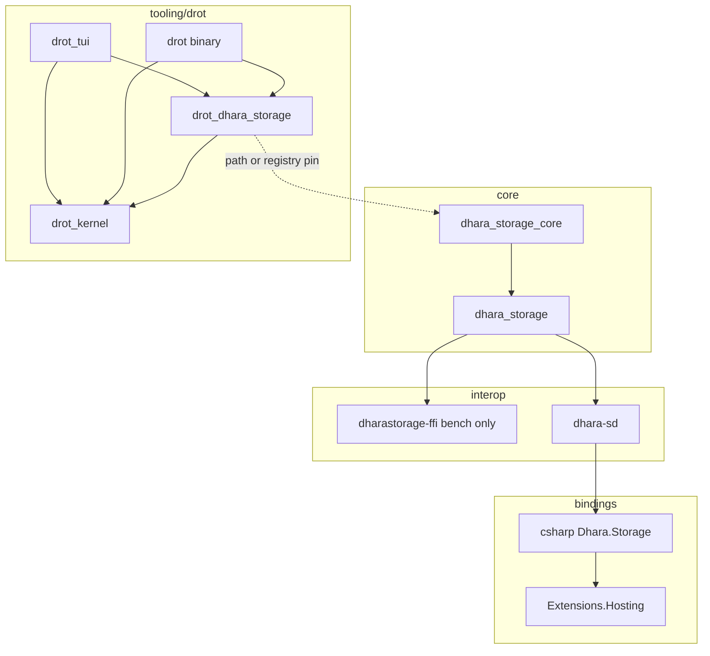

# Dhara Storage — workspace architecture

This document maps how the monorepo is organized after the tool-focused modularization pass: crate boundaries, operator-tool layering, bindings layout, publish pipelines, and how the tool couples to `dhara_storage_core` at compile time versus at release time.

## Repository layout

```mermaid
flowchart TB
  subgraph core [core]
    coreCrate[dhara_storage_core]
    runtime[dhara_storage]
  end

  subgraph interop [interop]
    ffi[dharastorage-ffi bench only]
    daemon[dhara-sd]
  end

  subgraph bindings [bindings]
    csharp[csharp Dhara.Storage]
    hosting[Extensions.Hosting]
  end

  subgraph tool [tooling/drot]
    kernel[drot_kernel]
    plugin[drot_dhara_storage]
    tui[drot_tui]
    bin[drot binary]
  end

  coreCrate --> runtime
  runtime --> ffi
  runtime --> daemon
  daemon --> csharp
  csharp --> hosting
  plugin --> kernel
  bin --> kernel
  bin --> plugin
  tui --> kernel
  tui --> plugin
  plugin -.->|path or registry pin| coreCrate
```

| Path | Role |
|------|------|
| `core/dhara_storage_core` | Framework / abstraction layer (`definitions` = DSFD today; no embedded defs) |
| `core/dhara_storage` | Business runtime; embeds `filedefs.dat` |
| `interop/dhara-sd` | Sidecar daemon (`dhara-sd`); gRPC + handle transfer |
| `interop/dharastorage-ffi` | C ABI crate — benchmark evidence only (not NuGet) |
| `bindings/csharp/` | `Dhara.Storage` NuGet, Hosting extensions, tests |
| `benchmark/` | Manual BenchmarkDotNet harness (not CI/CD) |
| `tooling/drot/crates/*` | Nested DROT workspace (submodule) — see [DROT docs](../tooling/drot/docs/README.md) |
| `dhara.config.toml` | Workspace semver, NuGet/CI metadata (not DROT tool version) |

## Operator tool (DROT submodule)

Operator CLI/TUI **documentation, AGENTS.md, and Cursor rules** live in the [`tooling/drot`](../tooling/drot) submodule ([dhara_repo_orchestration](https://github.com/D-Naveenz/dhara_repo_orchestration)), not in this `docs/` tree.

| Start here | Topic |
|------------|--------|
| [DROT AGENTS.md](../tooling/drot/AGENTS.md) | Tool intent, crate map, local commands |
| [DROT architecture](../tooling/drot/docs/architecture.md) | Crate DAG, TUI layout, path resolution |
| [TUI operation progress](../tooling/drot/docs/tui-progress.md) | Progress bar lifecycle |
| [Logging conventions](../tooling/drot/docs/logging.md) | Operator audit logs |

Storage still owns **host** concerns: how CI downloads DROT artifacts, `run-drot` scripts, and product coupling (below).

## Publish pipelines (host ↔ DROT)

Release logic in `drot_dhara_storage::ops::release` splits cleanly for CI:

| Workflow | Ops entry | Flags |
|----------|-----------|-------|
| `publish-crates.yml` | `release run` | `--skip-nuget` |
| `publish-nuget.yml` | `release run` | `--skip-cargo --prepacked-nuget <path>` |

PR CI (`pipeline.yml`) still produces `release-native-stage` and `release-nuget-package` artifacts; merge publishes download them at `HEAD^2` (merge second parent).

## Tool ↔ core coupling

| Concern | Mechanism |
|---------|-----------|
| **Compile-time codec** | `drot_dhara_storage` pins published `dhara_storage_core` from crates.io (no `dhara_storage_dal`) |
| **Compile-time core (after publish)** | Switch plugin dep to `dhara_storage_core = "0.9.22"`; optional DROT workspace `[patch.crates-io]` to the local path |
| **Embedded defs bytes** | `defs sync-embedded` writes git-tracked `core/dhara_storage/resources/filedefs.dat` — data path, not a path dependency |
| **Package version read** | Builder stamps `packageVersion` from linked codec crate `PACKAGE_VERSION` (dal interim; core after cutover) |

| Artifact | Version authority | Typical bump |
|----------|-------------------|--------------|
| `dhara_storage` / `dhara_storage_core` | `[versions].workspace` in `dhara.config.toml` | Minor release |
| `drot` | `tooling/drot/Cargo.toml` only | Independent tool releases via submodule pin |
| Tool codec dep | crates.io `dhara_storage_core` | Optional `[patch.crates-io]` in storage root for co-dev |

CI `pipeline.yml` may download DROT artifacts or build from source; the interim dal pin keeps orchestration artifact builds green.
## Related docs

- [CI/CD pipelines][ci-cd] — four-workflow map and path filters
- [filedefs.dat format][filedefs-dat]
- [Typed C-compatible ABI][typed-abi]
- [Native packaging][native-packaging]
- [DROT docs][drot-docs] — tool architecture, logging, TUI progress

[ci-cd]: ci-cd-pipelines.md
[filedefs-dat]: filedefs-dat.md
[typed-abi]: typed-c-compatible-abi.md
[native-packaging]: native-packaging.md
[drot-docs]: ../tooling/drot/docs/README.md
