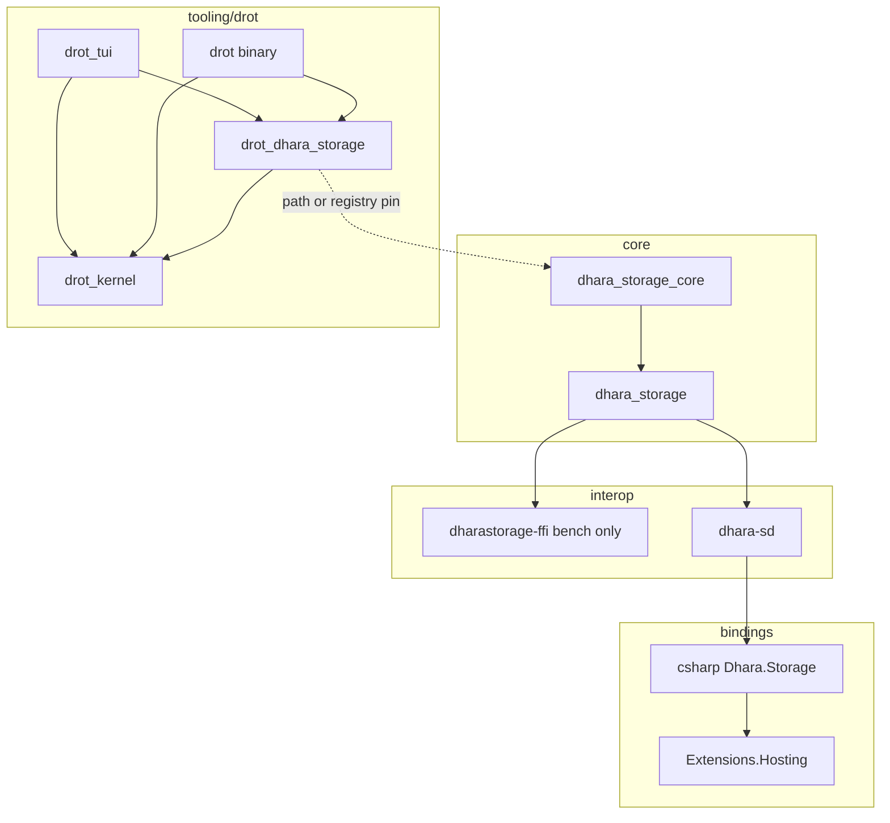

# Dhara Storage — workspace architecture

This document maps crate boundaries, bindings layout, publish pipelines, and how the DROT operator tool couples to `dhara_storage_core` at compile time versus at release time.

## Repository layout

```mermaid
flowchart TB
  subgraph core [core]
    coreCrate[dhara_storage_core]
    runtime[dhara_storage]
  end

  subgraph interop [interop]
    ffi[dharastorage-ffi bench only]
    daemon[dhara-sd]
  end

  subgraph bindings [bindings]
    csharp[csharp Dhara.Storage]
    hosting[Extensions.Hosting]
  end

  subgraph tool [tooling/drot]
    kernel[drot_kernel]
    plugin[drot_dhara_storage]
    tui[drot_tui]
    bin[drot binary]
  end

  coreCrate --> runtime
  runtime --> ffi
  runtime --> daemon
  daemon --> csharp
  csharp --> hosting
  plugin --> kernel
  bin --> kernel
  bin --> plugin
  tui --> kernel
  tui --> plugin
  plugin -.->|path or registry pin| coreCrate
```

| Path | Role |
|------|------|
| `core/dhara_storage_core` | Framework / abstraction layer (`definitions` = DSFD today; no embedded defs) |
| `core/dhara_storage` | Business runtime; embeds `filedefs.dat` |
| `interop/dhara-sd` | Sidecar daemon (`dhara-sd`); gRPC + handle transfer |
| `interop/dharastorage-ffi` | C ABI crate — benchmark evidence only (not NuGet) |
| `bindings/csharp/` | `Dhara.Storage` NuGet, Hosting extensions, tests |
| `benchmark/` | Manual BenchmarkDotNet harness (not CI/CD) |
| `tooling/drot/crates/*` | Nested DROT workspace (submodule) — see [DROT AGENTS.md](../tooling/drot/AGENTS.md) |
| `dhara.config.toml` | Workspace semver, NuGet/CI metadata (not DROT tool version) |

## Operator tool (DROT submodule)

Operator CLI/TUI documentation, AGENTS.md, and Cursor rules live in [`tooling/drot`](../tooling/drot) ([dhara_repo_orchestration](https://github.com/D-Naveenz/dhara_repo_orchestration)). Start at [DROT AGENTS.md](../tooling/drot/AGENTS.md). This host still owns CI artifact download, `run-drot` scripts, and product coupling below.

## Publish pipelines (host ↔ DROT)

Merge CD uses **composite Actions** (not `drot release run`):

| Workflow | Jobs | Action |
|----------|------|--------|
| `publish-crates.yml` | `dhara_storage_core` then `dhara_storage` (`needs` core; tag on core only) | [`publish-cargo-crate`](../.github/actions/publish-cargo-crate/action.yml) |
| `publish-nuget.yml` | prepare once → parallel `Dhara.Storage` / Hosting | [`publish-nuget-package`](../.github/actions/publish-nuget-package/action.yml) |

Local operator publish still uses DROT (`package publish` / `release run`) with `.env.local` (`NUGET_API_KEY` / `CARGO_REGISTRY_TOKEN`). Config ownership: [DROT host-config](../tooling/drot/docs/host-config.md).

PR CI (`pipeline.yml`) produces `release-native-stage` and `release-nuget-package` (primary + `ci.managed_package_projects`); merge NuGet CD downloads them at `HEAD^2` (merge second parent).

## Tool ↔ core coupling

| Concern | Mechanism |
|---------|-----------|
| **Compile-time codec** | `drot_dhara_storage` depends on published `dhara_storage_core` from crates.io (semver in that crate’s `Cargo.toml`; optional host `[patch.crates-io]` for co-dev) |
| **Embedded defs bytes** | `defs sync-embedded` writes git-tracked `core/dhara_storage/resources/filedefs.dat` — data path, not a path dependency |
| **Package version stamp** | Builder stamps `packageVersion` from the linked codec crate’s `PACKAGE_VERSION` |

| Artifact | Version authority | Typical bump |
|----------|-------------------|--------------|
| `dhara_storage` / `dhara_storage_core` | `[versions].workspace` in `dhara.config.toml` | Minor release |
| `drot` | `tooling/drot/Cargo.toml` only | Independent tool releases via submodule pin |
| Tool codec dep | crates.io `dhara_storage_core` | Optional `[patch.crates-io]` in storage root for co-dev |

CI `pipeline.yml` downloads DROT artifacts for the pinned submodule SHA (or builds from source when developing the tool).

## Related docs

- [CI/CD pipelines][ci-cd] — four-workflow map and path filters
- [filedefs.dat format][filedefs-dat]
- [Typed C-compatible ABI][typed-abi]
- [Native packaging][native-packaging]
- [DROT docs][drot-docs] — tool architecture, logging, TUI progress

[ci-cd]: ci-cd-pipelines.md
[filedefs-dat]: filedefs-dat.md
[typed-abi]: typed-c-compatible-abi.md
[native-packaging]: native-packaging.md
[drot-docs]: ../tooling/drot/docs/README.md
