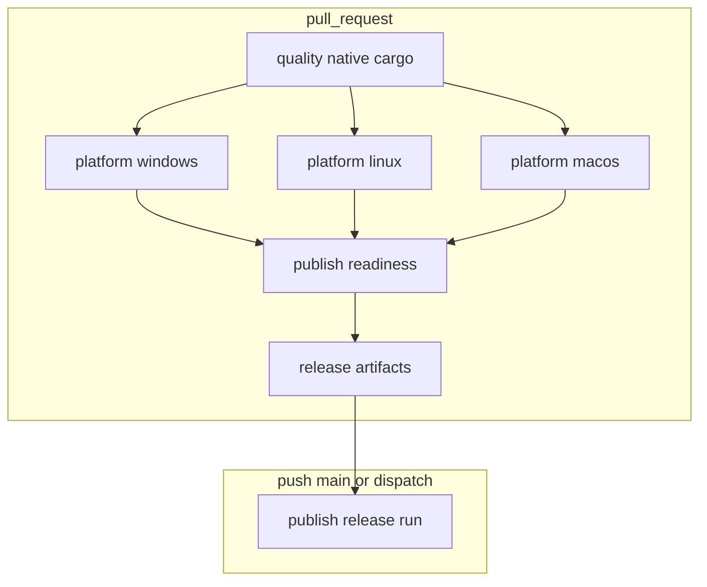

# CI/CD Pipeline Flow

Human-readable map of [`.github/workflows/pipeline.yml`](../.github/workflows/pipeline.yml) and where `dhara_tool` is used.

## Triggers

| Event | Jobs |
|-------|------|
| `pull_request` | `quality`, `platform-*`, `publish-readiness` |
| `push` to `main` (non-docs only) | `push-changes`, `publish` |
| `workflow_dispatch` | `publish` (manual release) |

**Concurrency:** PR runs cancel in-progress; `push` to `main` does not.

## Architecture

## Responsibility split

| Work | Runner |
|------|--------|
| `cargo fmt`, `clippy`, `cargo doc` | Workflow (`quality` job) |
| `cargo test`, `dotnet test` (Windows only) | Workflow (`platform-*` jobs) |
| `package stage-native` | `dhara_tool` (`--profile ci`) |
| Merge native stages | `tooling/scripts/merge-native.ps1` / `.sh` |
| `verify package` | `dhara_tool` |
| `release run` | `dhara_tool` with `--prepacked-nuget` on CD |

Local developers still use `cargo run -p dhara_tool -- verify ci` for an all-in-one check. GitHub Actions does **not** call `verify ci`.

## PR jobs

### `quality` (windows)

- `cargo fmt --check`, `clippy`, `cargo doc` for all workspace crates
- No `dhara_tool` compile

### `platform-{windows,linux,macos}`

- Rust tests: `dhara_storage` (all-features), `dhara_storage_dal`, `dharastorage`
- `dotnet test` on **Windows only**
- `cargo build -p dhara_tool --profile ci` then `package stage-native`
- Upload `native-stage-{os}` artifact

### `publish-readiness` (windows)

1. Download per-OS native artifacts
2. `merge-native.ps1` → `tooling/artifacts/native-stage`
3. `verify package --native-stage …`
4. Upload `release-native-stage`, `release-nuget-package`, `release-metadata` (90-day retention)

## CD job: `publish`

Runs on `workflow_dispatch` or `push` to `main` when non-doc paths changed.

1. Download PR CI artifacts for `${{ github.sha }}` via `dawidd6/action-download-artifact`
2. Fail if artifacts missing (squash merges need a follow-up policy)
3. `cargo build -p dhara_tool --profile ci`
4. `release run --native-stage … --prepacked-nuget …` (no rebuild, no re-verify)
5. `cargo-release` + `nuget push` inside the tool

**Dispatch inputs:** `dry_run`, `publish_cargo`, `publish_nuget`, `verify_package` (optional full verify on dry-run).

## `dhara_tool` build profile in CI

Root [`Cargo.toml`](../Cargo.toml) defines `[profile.ci]` (release without LTO) for the operator CLI. Shipped `dharastorage` natives still use workspace `[profile.release]` with LTO.

## Scripts

| Script | Role |
|--------|------|
| [`tooling/scripts/merge-native.ps1`](../tooling/scripts/merge-native.ps1) | Merge `runtimes/**` trees (Windows CI) |
| [`tooling/scripts/merge-native.sh`](../tooling/scripts/merge-native.sh) | Same for Linux/macOS locally |
| [`tooling/scripts/stage-native-windows.ps1`](../tooling/scripts/stage-native-windows.ps1) | vcvars + `dhara_tool package stage-native` |

## Related docs

- [logging.md](./logging.md) — audit logs under `tooling/logs/`
- [filedefs-dat.md](./filedefs-dat.md) — DSFD `packageVersion` uses DAL semver
- [tooling/dhara_tool/README.md](../tooling/dhara_tool/README.md)
