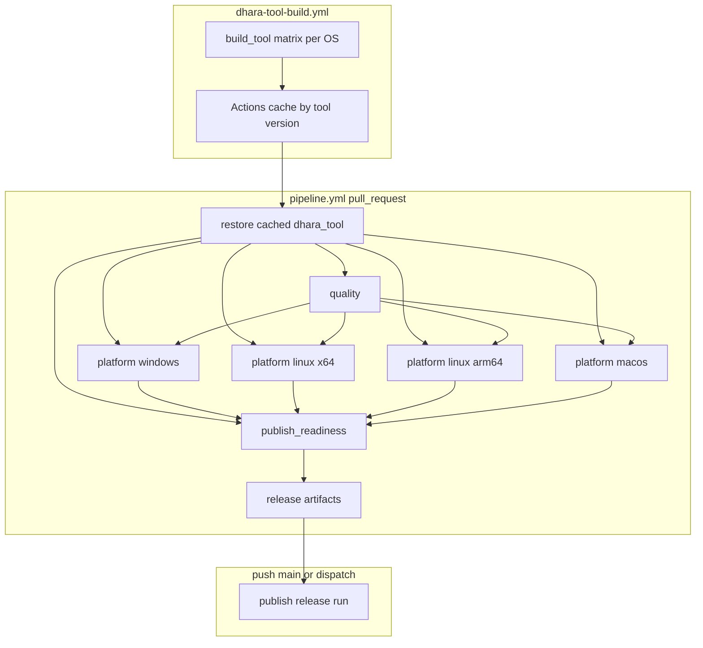

# CI/CD Pipeline Flow

Human-readable map of the [pipeline workflow][pipeline-yml], [dhara-tool-build workflow][tool-build-yml], and `dhara_tool` command touchpoints.

## Triggers

| Workflow | Event | Jobs |
|----------|-------|------|
| [pipeline.yml][pipeline-yml] | `pull_request` | `quality`, `platform-*`, `publish-readiness` |
| [pipeline.yml][pipeline-yml] | `push` to `main` (non-docs) | `push-changes`, `publish` |
| [pipeline.yml][pipeline-yml] | `workflow_dispatch` | `publish` |
| [dhara-tool-build.yml][tool-build-yml] | `push` to `development` / `main` (tool paths) | `build-tool` matrix |
| [dhara-tool-build.yml][tool-build-yml] | `workflow_dispatch` (`force`) | `build-tool` matrix |

**Concurrency:** PR pipeline runs cancel in-progress; `push` to `main` does not.

## Architecture

## Tool versioning and cache

- **Source of truth:** `version` in [`tooling/dhara_tool/Cargo.toml`](../tooling/dhara_tool/Cargo.toml) (independent of workspace library semver).
- **CI pin:** `[tool].version` in [`dhara.config.toml`](../dhara.config.toml) — `dhara_tool config sync` copies manifest → config.
- **Policy:** any change under `tooling/dhara_tool/**` must bump the tool version; cache key is `dhara-tool-{version}-{os-arch}` with no source hash.
- **Binary path:** `target/dist/dhara_tool` (`.exe` on Windows), built with `[profile.dist]` in root [`Cargo.toml`](../Cargo.toml).

## Responsibility split

| Work | Runner |
|------|--------|
| `quality fmt/clippy/doc` | Cached `dhara_tool` (`quality` job) |
| `quality test-rust` / `test-dotnet` | Cached `dhara_tool` (`platform-*`) |
| `package stage-native` | Cached `dhara_tool` (`--msvc-env` on Windows) |
| `native merge` | Cached `dhara_tool` (`publish-readiness`) |
| `verify package` / `release run` | Cached `dhara_tool` |
| `dharastorage` native compiles | Inside `package stage-native` (per OS, not cached) |

Local developers: `cargo run -p dhara_tool -- quality run` or [verify-local][verify-local-ps1] (forwards to `cargo run`).

## PR jobs

### `quality` (windows)

Restores `dhara-tool-{version}-windows-x64`, then:

- `dhara_tool quality fmt --check`
- `dhara_tool quality clippy`
- `dhara_tool quality doc`

### `platform-{windows,linux,linux-arm64,macos}`

Restores matching OS cache key, then:

- `dhara_tool quality test-rust`
- `dhara_tool quality test-dotnet` (Windows only)
- `dhara_tool package stage-native` (`--msvc-env` on Windows)

Upload `native-stage-{windows,linux,linux-arm64,macos}` artifact.

### `publish-readiness` (windows)

1. Download per-OS native artifacts (`native-stage-*`)
2. `dhara_tool native merge --output … --input …` (four inputs)
3. `dhara_tool verify package --native-stage …`
4. Upload `release-native-stage`, `release-nuget-package`, `release-metadata` (90-day retention)

## CD job: `publish`

1. Resolve artifact commit (`HEAD^2` for merge commits; `event.before^2` for direct main hotfixes) — see [native packaging][native-packaging].
2. Download PR CI artifacts for that commit.
3. Restore cached Windows `dhara_tool`.
4. `dhara_tool release run --prepacked-nuget …` (MSVC re-exec on Windows; no rebuild / re-verify).

## `dhara-tool-build` workflow

Per matrix leg (windows-x64, linux-x64, linux-arm64, osx-arm64):

1. Restore cache for `dhara-tool-{version}-{os-arch}`.
2. On cache hit → exit (no test, no compile).
3. On miss → `cargo test -p dhara_tool`, then `cargo build -p dhara_tool --profile dist`, save cache.

## Scripts

| Script | Role |
|--------|------|
| [verify-local.ps1][verify-local-ps1] / [`.sh`][verify-local-sh] | Thin wrapper → `cargo run -p dhara_tool -- quality run` |

## Related docs

- [Multi-platform native packaging][native-packaging] — RID staging rules, artifact SHA pitfalls
- [Logging conventions][logging] — audit logs under `tooling/logs/`
- [dhara_tool README][readme-tool] — full command surface
- [Docs index][docs-index]

[pipeline-yml]: ../.github/workflows/pipeline.yml
[tool-build-yml]: ../.github/workflows/dhara-tool-build.yml
[workspace-cargo]: ../Cargo.toml
[verify-local-ps1]: ../tooling/scripts/verify-local.ps1
[verify-local-sh]: ../tooling/scripts/verify-local.sh
[logging]: logging.md
[native-packaging]: native-packaging.md
[readme-tool]: ../tooling/dhara_tool/README.md
[docs-index]: README.md
