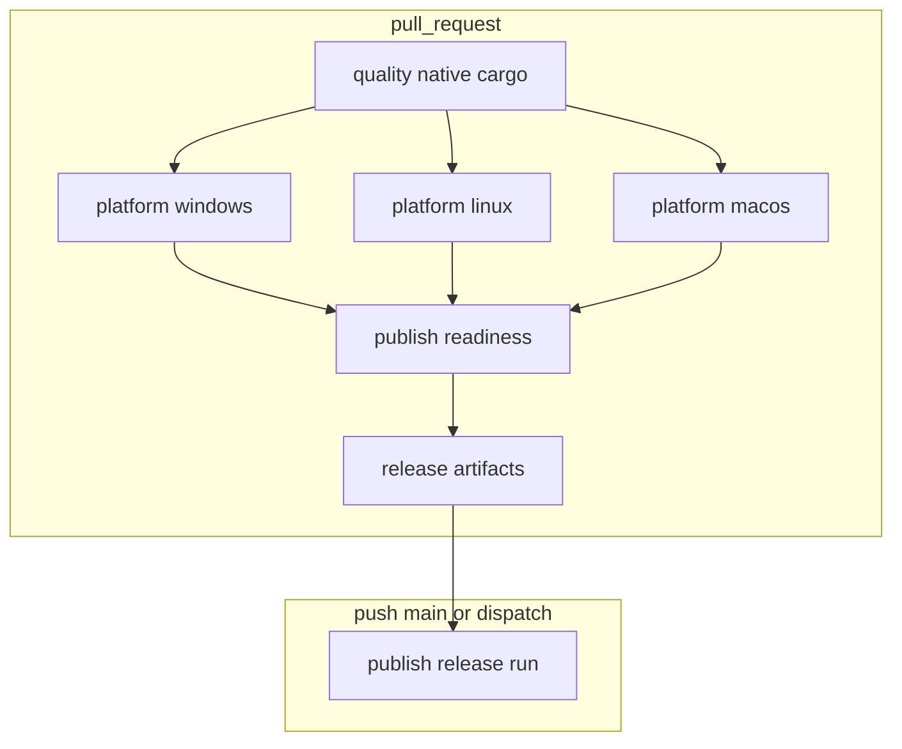

# CI/CD Pipeline Flow

Human-readable map of the [pipeline workflow][pipeline-yml], [tooling scripts][tooling-scripts], and where `dhara_tool` is used.

## Triggers

| Event | Jobs |
|-------|------|
| `pull_request` | `quality`, `platform-*`, `publish-readiness` |
| `push` to `main` (non-docs only) | `push-changes`, `publish` |
| `workflow_dispatch` | `publish` (manual release) |

**Concurrency:** PR runs cancel in-progress; `push` to `main` does not.

## Architecture

## Responsibility split

| Work | Runner |
|------|--------|
| `cargo fmt`, `clippy`, `cargo doc` | Workflow (`quality` job) |
| `cargo test`, `dotnet test` (Windows only) | Workflow (`platform-*` jobs) |
| `package stage-native` | `dhara_tool` via staging scripts (`--profile ci`) |
| Merge native stages | `tooling/scripts/merge-native.ps1` / `.sh` |
| `verify package` | `dhara_tool` via `verify-package.ps1` |
| `release run` | `dhara_tool` via `release-run-windows.ps1` with `--prepacked-nuget` on CD |

Local developers use [verify-local][verify-local-ps1] / [`.sh`][verify-local-sh] for CI parity. GitHub Actions does **not** invoke a combined verify command in the tool.

## PR jobs

### `quality` (windows)

- `cargo fmt --check`, `clippy`, `cargo doc` for all workspace crates
- No `dhara_tool` compile

### `platform-{windows,linux,macos}`

- Rust tests: `dhara_storage` (all-features), `dhara_storage_dal`, `dharastorage`
- `dotnet test` on **Windows only**
- Stage natives via `stage-native-windows.ps1` or `stage-native-{linux,macos}.sh`
- Upload `native-stage-{os}` artifact

### `publish-readiness` (windows)

1. Download per-OS native artifacts
2. `merge-native.ps1` → `tooling/artifacts/native-stage`
3. `verify-package.ps1` → `verify package --native-stage …`
4. Upload `release-native-stage`, `release-nuget-package`, `release-metadata` (90-day retention)

## CD job: `publish`

Runs on `workflow_dispatch` or `push` to `main` when non-doc paths changed.

1. Download PR CI artifacts for `${{ github.sha }}` via `dawidd6/action-download-artifact`
2. Fail if artifacts missing (squash merges need a follow-up policy)
3. `release-run-windows.ps1` with `--prepacked-nuget` (no rebuild, no re-verify)
4. `cargo-release` + `nuget push` inside the tool

**Dispatch inputs:** `dry_run`, `publish_cargo`, `publish_nuget`, `verify_package` (optional full verify on dry-run).

## `dhara_tool` build profile in CI

Root [Cargo.toml][workspace-cargo] defines `[profile.ci]` (release without LTO) for the operator CLI. Shipped `dharastorage` natives still use workspace `[profile.release]` with LTO.

## Scripts

| Script | Role |
|--------|------|
| [verify-local.ps1][verify-local-ps1] / [`.sh`][verify-local-sh] | Local CI parity: fmt, clippy, doc, Rust tests, dotnet test |
| [merge-native.ps1][merge-native-ps1] / [`.sh`][merge-native-sh] | Merge `runtimes/**` trees |
| [stage-native-windows.ps1][stage-native-windows] | vcvars + `package stage-native` |
| [stage-native-linux.sh][stage-native-linux] / [stage-native-macos.sh][stage-native-macos] | Build ci-profile tool + `package stage-native` |
| [verify-package.ps1][verify-package] | Build ci-profile tool + `verify package` |
| [release-run-windows.ps1][release-run-windows] | vcvars + `release run` with dispatch flags |

## Related docs

- [Logging conventions][logging] — audit logs under `tooling/logs/`
- [filedefs.dat / DSFD format][filedefs-dat] — DSFD `packageVersion` uses DAL semver
- [dhara_tool README][readme-tool] — operator command surface
- [Docs index][docs-index]

[pipeline-yml]: ../.github/workflows/pipeline.yml
[tooling-scripts]: ../tooling/scripts/
[workspace-cargo]: ../Cargo.toml
[verify-local-ps1]: ../tooling/scripts/verify-local.ps1
[verify-local-sh]: ../tooling/scripts/verify-local.sh
[merge-native-ps1]: ../tooling/scripts/merge-native.ps1
[merge-native-sh]: ../tooling/scripts/merge-native.sh
[stage-native-windows]: ../tooling/scripts/stage-native-windows.ps1
[stage-native-linux]: ../tooling/scripts/stage-native-linux.sh
[stage-native-macos]: ../tooling/scripts/stage-native-macos.sh
[verify-package]: ../tooling/scripts/verify-package.ps1
[release-run-windows]: ../tooling/scripts/release-run-windows.ps1
[logging]: logging.md
[filedefs-dat]: filedefs-dat.md
[readme-tool]: ../tooling/dhara_tool/README.md
[docs-index]: README.md
