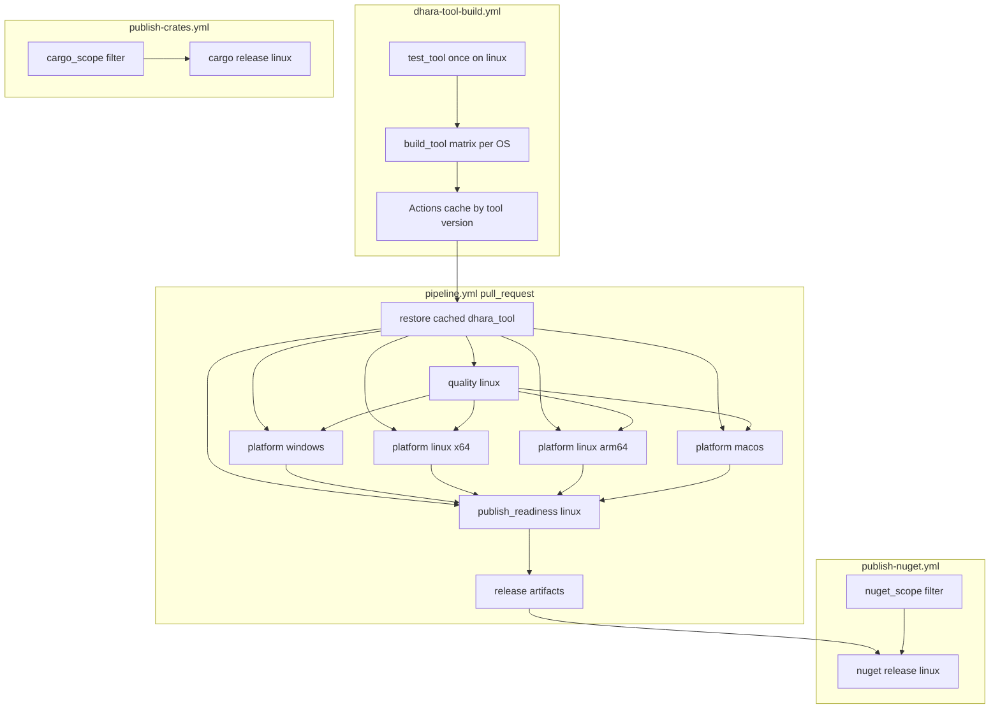

# CI/CD Pipeline Flow

Human-readable map of the four GitHub Actions workflows and `dhara_tool` command touchpoints.

## Triggers

| Workflow | Event | Jobs |
|----------|-------|------|
| [pipeline.yml][pipeline-yml] | `pull_request` | `quality`, `platform-*`, `publish-readiness` |
| [dhara-tool-build.yml][tool-build-yml] | `push` to `development` / `main` (tool paths) | `test-tool`, `build-tool` matrix |
| [dhara-tool-build.yml][tool-build-yml] | `pull_request` → `main` (tool paths) | `test-tool`, `build-tool` matrix |
| [dhara-tool-build.yml][tool-build-yml] | `workflow_dispatch` (`force`) | `test-tool`, `build-tool` matrix |
| [publish-crates.yml][publish-crates-yml] | `push` to `main` (cargo scope) | `detect-changes`, `publish` |
| [publish-crates.yml][publish-crates-yml] | `workflow_dispatch` | `detect-changes`, `publish` |
| [publish-nuget.yml][publish-nuget-yml] | `push` to `main` (nuget scope) | `detect-changes`, `publish` |
| [publish-nuget.yml][publish-nuget-yml] | `workflow_dispatch` | `detect-changes`, `publish` |

**Concurrency:** PR pipeline runs cancel in-progress; merge publishes do not.

## Architecture

## Path-scoped merge publishes

`dorny/paths-filter@v3` gates whether publish jobs run on `push` to `main`. `workflow_dispatch` always runs (escape hatch when automation skipped a merge).

| Filter | Paths (illustrative) | Skips when merge only touches |
|--------|----------------------|-------------------------------|
| **cargo_scope** | `src/core/dhara_storage/**`, `src/core/dhara_storage_dal/**`, `dhara.config.toml`, root `Cargo.toml` / `Cargo.lock` | `tooling/**`, `docs/**`, bindings-only, markdown |
| **nuget_scope** | `src/core/**`, `src/bindings/**`, `dhara.config.toml`, root manifests | `tooling/**`, `docs/**`, pure markdown |

| Merge diff example | `publish-crates` | `publish-nuget` |
|--------------------|------------------|-----------------|
| Docs / README only | skip | skip |
| `tooling/dhara_tool` only | skip | skip |
| Core crate + defs dat | run | run |
| C# bindings only | skip | run |
| FFI (`dharastorage-ffi`) only | skip | run |
| `dhara.config.toml` version bump | run | run |

NuGet CD still **requires PR artifacts** from `publish-readiness` at merge second parent (`HEAD^2`). Path filters gate *attempt*; they do not replace the artifact contract.

## Tool versioning and cache

- **Source of truth:** `[workspace.package].version` in [`tooling/dhara_tool/Cargo.toml`](../tooling/dhara_tool/Cargo.toml) (independent of workspace library semver).
- **CI pin:** `[tool].version` in [`dhara.config.toml`](../dhara.config.toml) — must match `tooling/dhara_tool/Cargo.toml` `[workspace.package].version` for tool-only bumps; activation propagates config into manifests on run (`--yes` in CI).
- **Policy:** any change under `tooling/dhara_tool/**` must bump the tool version; cache key is `dhara-tool-{version}-{os-arch}` with no source hash.
- **Cache scope:** caches saved on `development` / `main` pushes are scoped to that branch. PRs targeting `main` do not see `development`-only caches — `dhara-tool-build` also runs on `pull_request` → `main` (tool paths) to warm PR-visible caches. `restore-dhara-tool` saves the cache after a miss build so later jobs and re-runs can hit it.
- **PR cache miss:** `restore-dhara-tool` builds `profile.dist` when the versioned cache is unavailable, then saves it for the same key.
- **Binary path:** `target/dist/dhara_tool` (`.exe` on Windows), built with `[profile.dist]` in root [`Cargo.toml`](../Cargo.toml).
- **DAL coupling:** `dhara-tool-build` compiles against **crates.io** `dhara_storage_dal` (local `[patch.crates-io]` applies only in full workspace dev builds).

## Responsibility split

| Work | Runner |
|------|--------|
| `quality fmt/clippy/doc` | `ubuntu-latest` + `linux-x64` cached `dhara_tool` |
| `quality test-rust` / `test-dotnet` | Cached `dhara_tool` (`platform-*`; `test-dotnet` Windows only) |
| `package stage-native` | Per-OS runner (`--msvc-env` on `platform-windows` only) |
| `native merge` / `verify package` | `ubuntu-latest` + `linux-x64` cached `dhara_tool` (`publish-readiness`) |
| `release run --skip-nuget` (CD) | `ubuntu-latest` + `linux-x64` cached `dhara_tool` (`publish-crates`) |
| `release run --skip-cargo --prepacked-nuget` (CD) | `ubuntu-latest` + `linux-x64` + `nuget-production` (`publish-nuget`) |
| `dharastorage` native compiles | Inside `package stage-native` (per OS, not cached) |

Local developers: `cargo run -p dhara_tool -- quality run` or [verify-local][verify-local-ps1] (forwards to `cargo run`).

## PR jobs

### `quality` (linux)

Restores `dhara-tool-{version}-linux-x64` on `ubuntu-latest`, then (all invocations use `--yes`):

- `dhara_tool --yes quality fmt --check`
- `dhara_tool --yes quality clippy`
- `dhara_tool --yes quality doc`

### `platform-{windows,linux,linux-arm64,macos}`

Restores matching OS cache key, then:

- `dhara_tool quality test-rust`
- `dhara_tool quality test-dotnet` (Windows only)
- `dhara_tool package stage-native` (`--msvc-env` on Windows)

Upload `native-stage-{windows,linux,linux-arm64,macos}` from `target/dist/artifacts/native-stage`.

### `publish-readiness` (linux)

On `ubuntu-latest`, restores `dhara-tool-{version}-linux-x64`, then:

1. Download per-OS native artifacts into `target/dist/artifacts/native-inputs/`
2. `dhara_tool native merge --output target/dist/artifacts/native-stage --input …` (four inputs)
3. `dhara_tool verify package` (default stage under dist `tool_root`)
4. Upload `release-native-stage`, `release-nuget-package` (`target/dist/output/nuget/`), `release-metadata` (90-day retention)

## CD: `publish-crates`

1. `detect-changes` — `cargo_scope` filter (or always on `workflow_dispatch`).
2. Restore cached `linux-x64` `dhara_tool`.
3. `dhara_tool release run --skip-nuget` (`CARGO_REGISTRY_TOKEN`).

## CD: `publish-nuget`

1. `detect-changes` — `nuget_scope` filter (or always on `workflow_dispatch`).
2. Resolve artifact commit (`HEAD^2` for merge commits) — see [native packaging][native-packaging].
3. Download PR CI artifacts for that commit.
4. Restore cached `linux-x64` `dhara_tool` on `ubuntu-latest`.
5. `dhara_tool release run --skip-cargo --prepacked-nuget …` (`NUGET_API_KEY`, `nuget-production` environment).

## `dhara-tool-build` workflow

1. **`test-tool`** (ubuntu-latest) — `cargo test -p dhara_tool` once. Platform-specific behavior (path resolution, MSVC re-exec) is covered by pipeline jobs on real runners, not duplicated here.
2. **`build-tool` matrix** (windows-x64, linux-x64, linux-arm64, osx-arm64), after tests pass:
   - Restore cache for `dhara-tool-{version}-{os-arch}`.
   - On cache hit → exit (no compile).
   - On miss → `cargo build -p dhara_tool --profile dist`, smoke `--version`, save cache.

**Local parity:** [`ensure-dhara-tool-dist.ps1`][ensure-dist-ps1] / [`.sh`][ensure-dist-sh] use the same version gate (`workspace.package.version` vs `target/dist/dhara_tool --version`). Rebuild only on missing binary or version mismatch; `-Force` / `--force` for manual refresh.

## Scripts

| Script | Role |
|--------|------|
| [ensure-dhara-tool-dist.ps1][ensure-dist-ps1] / [`.sh`][ensure-dist-sh] | Version-gated `profile.dist` build → `target/dist/` |
| [verify-local.ps1][verify-local-ps1] / [`.sh`][verify-local-sh] | `ensure-dhara-tool-dist` → `target/dist/dhara_tool quality run` |

## Related docs

- [Workspace architecture][architecture] — tool crate DAG, DAL coupling
- [Multi-platform native packaging][native-packaging] — RID staging rules, artifact SHA pitfalls
- [Logging conventions][logging] — audit logs under `{tool_root}/logs/` (e.g. `target/dist/logs/`)
- [dhara_tool README][readme-tool] — full command surface
- [Docs index][docs-index]

[pipeline-yml]: ../.github/workflows/pipeline.yml
[tool-build-yml]: ../.github/workflows/dhara-tool-build.yml
[publish-crates-yml]: ../.github/workflows/publish-crates.yml
[publish-nuget-yml]: ../.github/workflows/publish-nuget.yml
[workspace-cargo]: ../Cargo.toml
[verify-local-ps1]: ../tooling/scripts/verify-local.ps1
[verify-local-sh]: ../tooling/scripts/verify-local.sh
[ensure-dist-ps1]: ../tooling/scripts/ensure-dhara-tool-dist.ps1
[ensure-dist-sh]: ../tooling/scripts/ensure-dhara-tool-dist.sh
[logging]: logging.md
[native-packaging]: native-packaging.md
[architecture]: architecture.md
[readme-tool]: ../tooling/dhara_tool/README.md
[docs-index]: README.md
