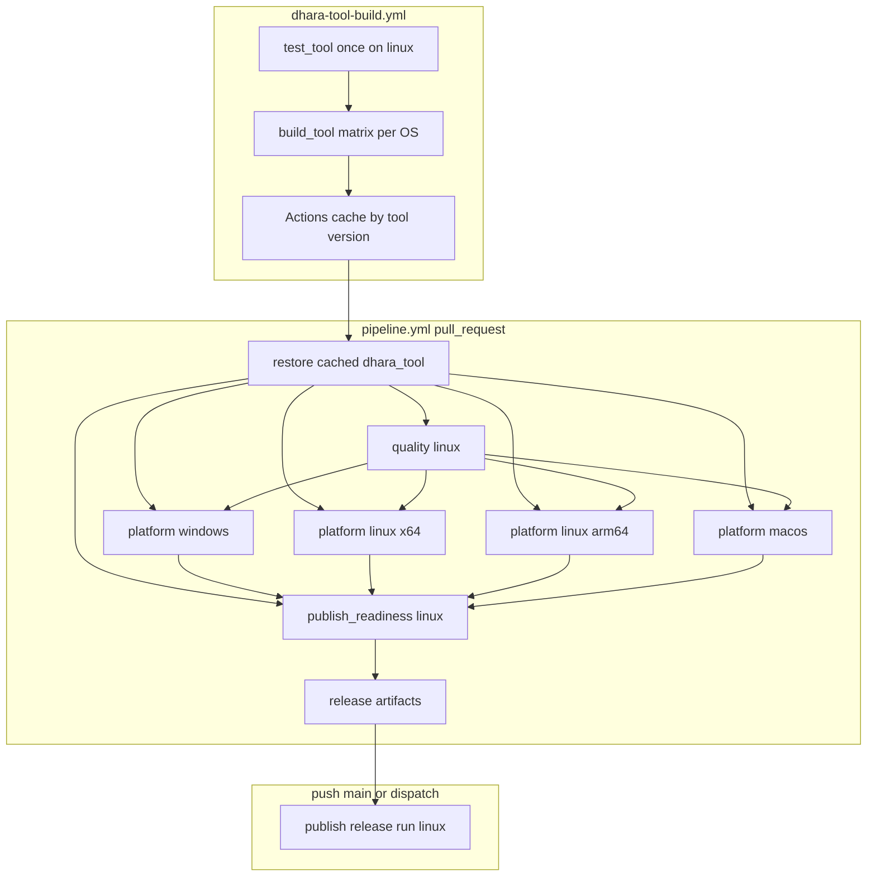

# CI/CD Pipeline Flow

Human-readable map of the [pipeline workflow][pipeline-yml], [dhara-tool-build workflow][tool-build-yml], and `dhara_tool` command touchpoints.

## Triggers

| Workflow | Event | Jobs |
|----------|-------|------|
| [pipeline.yml][pipeline-yml] | `pull_request` | `quality`, `platform-*`, `publish-readiness` |
| [pipeline.yml][pipeline-yml] | `push` to `main` (non-docs) | `push-changes`, `publish` |
| [pipeline.yml][pipeline-yml] | `workflow_dispatch` | `publish` |
| [dhara-tool-build.yml][tool-build-yml] | `push` to `development` / `main` (tool paths) | `test-tool`, `build-tool` matrix |
| [dhara-tool-build.yml][tool-build-yml] | `workflow_dispatch` (`force`) | `test-tool`, `build-tool` matrix |

**Concurrency:** PR pipeline runs cancel in-progress; `push` to `main` does not.

## Architecture

## Tool versioning and cache

- **Source of truth:** `version` in [`tooling/dhara_tool/Cargo.toml`](../tooling/dhara_tool/Cargo.toml) (independent of workspace library semver).
- **CI pin:** `[tool].version` in [`dhara.config.toml`](../dhara.config.toml) — `dhara_tool config sync` copies manifest → config.
- **Policy:** any change under `tooling/dhara_tool/**` must bump the tool version; cache key is `dhara-tool-{version}-{os-arch}` with no source hash.
- **Binary path:** `target/dist/dhara_tool` (`.exe` on Windows), built with `[profile.dist]` in root [`Cargo.toml`](../Cargo.toml).

## Responsibility split

| Work | Runner |
|------|--------|
| `quality fmt/clippy/doc` | `ubuntu-latest` + `linux-x64` cached `dhara_tool` |
| `quality test-rust` / `test-dotnet` | Cached `dhara_tool` (`platform-*`; `test-dotnet` Windows only) |
| `package stage-native` | Per-OS runner (`--msvc-env` on `platform-windows` only) |
| `native merge` / `verify package` | `ubuntu-latest` + `linux-x64` cached `dhara_tool` (`publish-readiness`) |
| `release run` (CD) | `ubuntu-latest` + `linux-x64` cached `dhara_tool` |
| `dharastorage` native compiles | Inside `package stage-native` (per OS, not cached) |

Local developers: `cargo run -p dhara_tool -- quality run` or [verify-local][verify-local-ps1] (forwards to `cargo run`).

## PR jobs

### `quality` (linux)

Restores `dhara-tool-{version}-linux-x64` on `ubuntu-latest`, then:

- `dhara_tool quality fmt --check`
- `dhara_tool quality clippy`
- `dhara_tool quality doc`

### `platform-{windows,linux,linux-arm64,macos}`

Restores matching OS cache key, then:

- `dhara_tool quality test-rust`
- `dhara_tool quality test-dotnet` (Windows only)
- `dhara_tool package stage-native` (`--msvc-env` on Windows)

Upload `native-stage-{windows,linux,linux-arm64,macos}` from `target/dist/artifacts/native-stage`.

### `publish-readiness` (linux)

On `ubuntu-latest`, restores `dhara-tool-{version}-linux-x64`, then:

1. Download per-OS native artifacts into `target/dist/artifacts/native-inputs/`
2. `dhara_tool native merge --output target/dist/artifacts/native-stage --input …` (four inputs)
3. `dhara_tool verify package` (default stage under dist `tool_root`)
4. Upload `release-native-stage`, `release-nuget-package` (`target/dist/output/nuget/`), `release-metadata` (90-day retention)

## CD job: `publish`

1. Resolve artifact commit (`HEAD^2` for merge commits; `event.before^2` for direct main hotfixes) — see [native packaging][native-packaging].
2. Download PR CI artifacts for that commit.
3. Restore cached `linux-x64` `dhara_tool` on `ubuntu-latest`.
4. `dhara_tool release run --prepacked-nuget …` (no native rebuild / re-verify).

## `dhara-tool-build` workflow

1. **`test-tool`** (ubuntu-latest) — `cargo test -p dhara_tool` once. Platform-specific behavior (path resolution, MSVC re-exec) is covered by pipeline jobs on real runners, not duplicated here.
2. **`build-tool` matrix** (windows-x64, linux-x64, linux-arm64, osx-arm64), after tests pass:
   - Restore cache for `dhara-tool-{version}-{os-arch}`.
   - On cache hit → exit (no compile).
   - On miss → `cargo build -p dhara_tool --profile dist`, smoke `--version`, save cache.

**Local parity:** [`ensure-dhara-tool-dist.ps1`][ensure-dist-ps1] / [`.sh`][ensure-dist-sh] use the same version gate (`Cargo.toml` vs `target/dist/dhara_tool --version`). Rebuild only on missing binary or version mismatch; `-Force` / `--force` for manual refresh.

## Scripts

| Script | Role |
|--------|------|
| [ensure-dhara-tool-dist.ps1][ensure-dist-ps1] / [`.sh`][ensure-dist-sh] | Version-gated `profile.dist` build → `target/dist/` |
| [verify-local.ps1][verify-local-ps1] / [`.sh`][verify-local-sh] | `ensure-dhara-tool-dist` → `target/dist/dhara_tool quality run` |

## Related docs

- [Multi-platform native packaging][native-packaging] — RID staging rules, artifact SHA pitfalls
- [Logging conventions][logging] — audit logs under `{tool_root}/logs/` (e.g. `target/dist/logs/`)
- [dhara_tool README][readme-tool] — full command surface
- [Docs index][docs-index]

[pipeline-yml]: ../.github/workflows/pipeline.yml
[tool-build-yml]: ../.github/workflows/dhara-tool-build.yml
[workspace-cargo]: ../Cargo.toml
[verify-local-ps1]: ../tooling/scripts/verify-local.ps1
[verify-local-sh]: ../tooling/scripts/verify-local.sh
[ensure-dist-ps1]: ../tooling/scripts/ensure-dhara-tool-dist.ps1
[ensure-dist-sh]: ../tooling/scripts/ensure-dhara-tool-dist.sh
[logging]: logging.md
[native-packaging]: native-packaging.md
[readme-tool]: ../tooling/dhara_tool/README.md
[docs-index]: README.md
