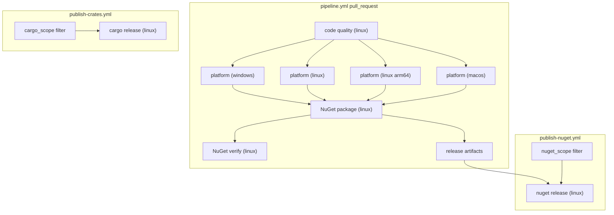

# CI/CD Pipeline Flow

Human-readable map of GitHub Actions workflows and where `drot` is used versus direct CLI commands.

## Triggers

| Workflow | Event | Jobs |
|----------|-------|------|
| [pipeline.yml][pipeline-yml] | `pull_request` | `code quality (linux)`, `platform (*)`, `NuGet package (linux)`, `NuGet verify (linux)` |
| [pipeline.yml][pipeline-yml] | `workflow_dispatch` (`force_tool_rebuild`) | Same jobs |
| [publish-crates.yml][publish-crates-yml] | `push` to `main` (cargo scope) | `detect-changes`, `cargo release (linux)` |
| [publish-crates.yml][publish-crates-yml] | `workflow_dispatch` | `detect-changes`, `cargo release (linux)` |
| [publish-nuget.yml][publish-nuget-yml] | `push` to `main` (nuget scope) | `detect-changes`, `nuget release (linux)` |
| [publish-nuget.yml][publish-nuget-yml] | `workflow_dispatch` | `detect-changes`, `nuget release (linux)` |

**Concurrency:** PR pipeline runs cancel in-progress; merge publishes do not.

## Architecture

```mermaid
flowchart TB
  subgraph pr ["pipeline.yml pull_request"]
    Q["code quality (linux)"]
    PW["platform (windows)"]
    PL["platform (linux)"]
    PLA["platform (linux arm64)"]
    PM["platform (macos)"]
    PACK["NuGet package (linux)"]
    VER["NuGet verify (linux)"]
    Q --> PW & PL & PLA & PM
    PW & PL & PLA & PM --> PACK
    PACK --> VER
    PACK --> ART[release artifacts]
  end

  subgraph cd_cargo ["publish-crates.yml"]
    FC[cargo_scope filter]
    CR["cargo release (linux)"]
    FC --> CR
  end

  subgraph cd_nuget ["publish-nuget.yml"]
    FN[nuget_scope filter]
    NU["nuget release (linux)"]
    ART --> NU
    FN --> NU
  end
```

## Tool vs direct commands

| Work | CI implementation |
|------|-------------------|
| `fmt` / `clippy` / `doc` (core + FFI) | Direct `cargo` on `ubuntu-latest` — **no tool**; [`setup-linux-tool-deps`](../.github/actions/setup-linux-tool-deps/action.yml) for GTK/glib (`dhara_storage` / `file_icon_provider`) |
| `fmt` on `drot` | Direct `cargo fmt` only (no clippy/doc for tool in CI) |
| `cargo test` (core crates) | Direct `cargo test` on `platform (linux)` only |
| `dotnet test` | Direct `dotnet test` on `platform (linux)` only |
| Native staging (Linux/macOS) | Direct `cargo build -p dhara-sd --release --target …` + copy into `runtimes/` |
| Native staging (Windows) | Downloaded `drot package stage-native --msvc-env` (expects `dhara-sd.exe`) |
| `drot` binary | [`download-drot`](../.github/actions/download-drot/action.yml) artifact for pinned `tooling/drot` submodule SHA — **not** rebuilt on product-only PRs |
| Native merge | Inline shell copy of `runtimes/` trees (no tool) |
| `package pack` | `drot package pack` on `NuGet package (linux)` with merged `--native-stage` |
| `verify package` | `drot verify package` on `NuGet verify (linux)` — ConsumerSmoke + AOT on `linux-x64` (`ci.host_runtime_smoke` / `ci.aot_runtime_smoke`) |
| Cargo CD | Direct `cargo release …` ([`publish-crates.yml`](../.github/workflows/publish-crates.yml)) |
| NuGet CD | Direct `dotnet nuget push` ([`publish-nuget.yml`](../.github/workflows/publish-nuget.yml)) |

**Linux GUI rule:** on Linux jobs that **link** `dhara_storage` (clippy/tests with default deps) or **build** `drot`, run [`setup-linux-tool-deps`](../.github/actions/setup-linux-tool-deps/action.yml) first (glib, gtk, pkg-config, wayland). Restoring a cached dist binary alone does not require those packages.

**NativeAOT smoke on Linux:** `NuGet verify (linux)` installs `clang` and `zlib1g-dev` before `verify package`.

## Tool acquisition

- **CI:** [`download-drot`](../.github/actions/download-drot/action.yml) fetches `drot-windows-x64` or `drot-linux-x64` from `dhara_repo_orchestration` for `git rev-parse HEAD:tooling/drot` (secret `DROT_ARTIFACTS_TOKEN`). Product-only PRs skip rebuilding the tool when the submodule gitlink is unchanged.
- **Local / AI:** [`run-drot.ps1`](../tooling/scripts/run-drot.ps1) / [`.sh`](../tooling/scripts/run-drot.sh) version-gates `target/dist/drot` + `drot_tui` against `tooling/drot/Cargo.toml`, builds from the submodule only when missing or stale (`--force-build`). With **no args**, opens the **TUI**. Agents and scripts pass `-Cli` / `--cli` (or any command tokens) to run the direct CLI with `-r` defaulting to the storage repo root.
- **Full local build:** `run-drot -Cli --yes build run` (or TUI **Build → Run full local repository build workflow**) — config drift → defs sync → quality → native stage → verify package.
- **Binary path:** `target/dist/drot` (`.exe` on Windows). `[profile.dist]` lives in [`tooling/drot/Cargo.toml`](../tooling/drot/Cargo.toml).

## Path-scoped merge publishes

`dorny/paths-filter@v4` gates whether publish jobs run on `push` to `main`. `workflow_dispatch` always runs.

| Filter | Paths (illustrative) | Skips when merge only touches |
|--------|----------------------|-------------------------------|
| **cargo_scope** | `core/dhara_storage/**`, `core/dhara_storage_core/**`, `dhara.config.toml`, root manifests | `tooling/**`, `docs/**`, bindings-only |
| **nuget_scope** | `core/**`, `interop/**`, `bindings/**`, `dhara.config.toml`, root manifests | `tooling/**`, `docs/**`, pure markdown |

NuGet CD still **requires PR artifacts** from `NuGet package (linux)` at merge second parent (`HEAD^2`).

## PR jobs

### `code quality (linux)`

Direct commands (no `drot`); [`setup-linux-tool-deps`](../.github/actions/setup-linux-tool-deps/action.yml) for GTK/glib:

- `cargo fmt -p dhara_storage_core -p dhara_storage -p dharastorage-ffi -p dhara-sd --check`
- `cargo clippy` on `dhara_storage` (all targets/features), then `dhara_storage_core` + `dharastorage-ffi` + `dhara-sd`
- `cargo doc --no-deps` on core + FFI + `dhara-sd`

### `platform (windows)`

After `code quality (linux)` — **native staging only**:

1. [`download-drot`](../.github/actions/download-drot/action.yml) (`drot-windows-x64`).
2. `drot package stage-native --msvc-env` (stages `dhara-sd.exe`).
3. Upload `native-stage-windows`.

### `platform (linux)`

After `code quality (linux)` — **primary managed + Rust gate + staging**:

1. [`setup-linux-tool-deps`](../.github/actions/setup-linux-tool-deps/action.yml).
2. Direct Rust tests (`dhara_storage`, `dhara_storage_core`, `dharastorage-ffi`) and `cargo build -p dhara-sd`.
3. `dotnet test` on `Dhara.Storage.Tests` under `xvfb-run` (shell-icon coverage).
4. Direct `cargo build -p dhara-sd` for `linux-x64` native staging.
5. Upload `native-stage-linux`.

### `platform (linux arm64|macos)`

After `code quality (linux)` — **native staging only**:

1. [`setup-linux-tool-deps`](../.github/actions/setup-linux-tool-deps/action.yml) on Linux ARM64.
2. Direct `cargo build -p dhara-sd` for the platform RID; upload `native-stage-{linux-arm64,macos}`.

CI does **not** run `cargo test -p drot`; developers validate the tool locally.

### `NuGet package (linux)`

After all platform jobs:

1. [`download-drot`](../.github/actions/download-drot/action.yml) (`drot-linux-x64`).
2. Download four native-stage artifacts; merge `runtimes/` inline.
3. `drot package pack --native-stage target/dist/artifacts/native-stage`
4. Upload `release-native-stage`, `release-nuget-package`, `release-metadata` (90-day retention).

### `NuGet verify (linux)`

After `NuGet package (linux)`:

1. [`download-drot`](../.github/actions/download-drot/action.yml) (`drot-linux-x64`).
2. Download `release-native-stage` artifact.
3. `drot verify package --native-stage target/dist/artifacts/native-stage` (ConsumerSmoke + AOT on `linux-x64`).

## CD: `publish-crates`

1. `detect-changes` — `cargo_scope` filter (or always on `workflow_dispatch`).
2. [`setup-linux-tool-deps`](../.github/actions/setup-linux-tool-deps/action.yml) — `cargo release` verifies crate tarballs by building `dhara_storage` (GTK/glib via `file_icon_provider`).
3. `cargo release --workspace --isolated --allow-branch main --tag-name 'v{{version}}' --no-confirm --execute` (`CARGO_REGISTRY_TOKEN`). Dry-run uses `--allow-branch '*'` and `--no-verify`.

## CD: `publish-nuget`

1. `detect-changes` — `nuget_scope` filter (or always on `workflow_dispatch`).
2. Resolve artifact commit (`HEAD^2` for merge commits) — see [native packaging][native-packaging].
3. Download PR CI artifacts for that commit.
4. `dotnet nuget push` with `NUGET_API_KEY` and source from `dhara.config.toml`.

## Local parity

[`run-drot.ps1`][run-drot-ps1] / [`.sh`][run-drot-sh] version-gate the dist binaries (default TUI; `-Cli` / `--cli` for scripted CLI). [`verify-local.ps1`][verify-local-ps1] runs `run-drot -Cli --yes quality run` — stricter than PR CI.

## Related docs

- [Workspace architecture][architecture] — tool crate DAG
- [Multi-platform native packaging][native-packaging] — RID staging, artifact SHA pitfalls
- [Logging conventions][logging] — audit logs under `{tool_root}/logs/`
- [drot README][readme-tool] — full command surface
- [Docs index][docs-index]

[pipeline-yml]: ../.github/workflows/pipeline.yml
[publish-crates-yml]: ../.github/workflows/publish-crates.yml
[publish-nuget-yml]: ../.github/workflows/publish-nuget.yml
[workspace-cargo]: ../Cargo.toml
[verify-local-ps1]: ../tooling/scripts/verify-local.ps1
[verify-local-sh]: ../tooling/scripts/verify-local.sh
[run-drot-ps1]: ../tooling/scripts/run-drot.ps1
[run-drot-sh]: ../tooling/scripts/run-drot.sh
[ensure-dist-ps1]: ../tooling/scripts/ensure-drot-dist.ps1
[ensure-dist-sh]: ../tooling/scripts/ensure-drot-dist.sh
[logging]: logging.md
[native-packaging]: native-packaging.md
[architecture]: architecture.md
[readme-tool]: ../tooling/drot/README.md
[docs-index]: README.md
