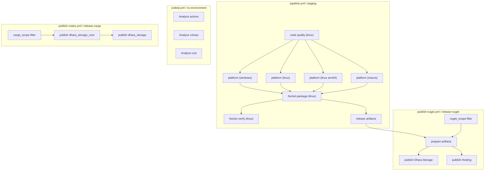

# CI/CD Pipeline Flow

Human-readable map of GitHub Actions workflows and where `drot` is used versus direct CLI commands.

## Triggers

| Workflow | Event | Jobs | GitHub Environment |
|----------|-------|------|--------------------|
| [pipeline.yml][pipeline-yml] | `pull_request` (skips Dependabot → `development`) | `code quality (linux)`, `platform (*)`, `NuGet package (linux)`, `NuGet verify (linux)` | `staging` |
| [pipeline.yml][pipeline-yml] | `workflow_dispatch` | Same jobs | `staging` |
| [ensure-development.yml][ensure-development-yml] | `push` to `main` / Monday 04:00 UTC / `workflow_dispatch` | `ensure development exists` | — |
| [dependabot-auto-merge.yml][dependabot-auto-merge-yml] | `pull_request` (Dependabot → `development` only) | `enable squash auto-merge` | — |
| [codeql.yml][codeql-yml] | `pull_request` / `push` to `main` / weekly cron | `Analyze (actions\|csharp\|rust)` | — (none; no staging secrets) |
| [publish-crates.yml][publish-crates-yml] | `push` to `main` (cargo scope) | `detect-changes`, `publish dhara_storage_core`, `publish dhara_storage` | `release-cargo` (publish jobs) |
| [publish-crates.yml][publish-crates-yml] | `workflow_dispatch` | Same | `release-cargo` (publish jobs) |
| [publish-nuget.yml][publish-nuget-yml] | `push` to `main` (nuget scope) | `detect-changes`, `prepare`, parallel `publish Dhara.Storage` / `Hosting` | `release-nuget` (publish jobs) |
| [publish-nuget.yml][publish-nuget-yml] | `workflow_dispatch` | Same | `release-nuget` (publish jobs) |

**Concurrency:** PR pipeline and CodeQL runs cancel in-progress; merge publishes do not.

### Branch flow and Dependabot

Integration path: **feature → `development` → `main`**. Squash vs merge is a per-PR choice (feature → `development` is usually squash; `development` → `main` is always human-reviewed — never auto-merged).

| Concern | Behavior |
|---------|----------|
| Dependabot version updates | [`dependabot.yml`][dependabot-yml] `target-branch: development`; weekly Monday 06:00 UTC; Cargo and Actions updates are **grouped** |
| Missing `development` | [ensure-development.yml][ensure-development-yml] creates it from `main` if absent; never resets an existing branch |
| Dependabot auto-merge | [dependabot-auto-merge.yml][dependabot-auto-merge-yml] enables **squash** auto-merge for patch/minor PRs into `development` only |
| PRs into `main` | No workflow enables auto-merge (including `development` → `main` and Dependabot **security** updates, which always target the default branch) |
| Pipeline cost | Full [pipeline.yml][pipeline-yml] is **skipped** when the PR author is `dependabot[bot]` and the base is `development`; security PRs to `main` still run Pipeline |
| Feature → `development` | Prefer squash; enable GitHub UI auto-merge yourself (no bot auto-approves every human PR — `development` has no required checks, so a bot would race ahead of CI) |

### GitHub Environments

Credentials live on **Environments only** — not repository Actions secrets/variables. Separate environments keep Cargo and NuGet deployment history independent and scope credentials per ecosystem.

| Environment | Used by | Auth / secrets |
|-------------|---------|----------------|
| `staging` | PR / `workflow_dispatch` jobs in [pipeline.yml][pipeline-yml] | Secret `DROT_ARTIFACTS_TOKEN` |
| `release-nuget` | Per-package publish jobs in [publish-nuget.yml][publish-nuget-yml] | Variable `NUGET_USER` (+ optional `NUGET_SOURCE`); OIDC first, then optional secret `NUGET_API_KEY` fallback |
| `release-cargo` | Per-crate publish jobs in [publish-crates.yml][publish-crates-yml] | OIDC first, then optional secret `CARGO_REGISTRY_TOKEN` fallback |

Workflows with **no** Environment column ([ensure-development.yml][ensure-development-yml], [dependabot-auto-merge.yml][dependabot-auto-merge-yml], [codeql.yml][codeql-yml]) use only the built-in Actions `github.token` — no custom secret or Environment is required.

Create these under **Settings → Environments**. Restrict `release-*` to `main`; do not add required reviewers on `staging` (that would block every PR). Leave crates.io **Require trusted publishing for all new versions** unchecked while API-token fallback is still needed.

**Publish auth flow (NuGet + Cargo):** try Trusted Publishing (OIDC) first. If the version is already live, log that and exit successfully (no fallback). Any other failure treats Trusted Publishing as misconfigured and falls back to the long-lived API key/token when present; missing fallback credentials fail the job.

## Architecture

```mermaid
flowchart TB
  subgraph pr ["pipeline.yml / staging"]
    Q["code quality (linux)"]
    PW["platform (windows)"]
    PL["platform (linux)"]
    PLA["platform (linux arm64)"]
    PM["platform (macos)"]
    PACK["NuGet package (linux)"]
    VER["NuGet verify (linux)"]
    Q --> PW & PL & PLA & PM
    PW & PL & PLA & PM --> PACK
    PACK --> VER
    PACK --> ART[release artifacts]
  end

  subgraph sast ["codeql.yml / no environment"]
    CA["Analyze actions"]
    CC["Analyze csharp"]
    CRU["Analyze rust"]
  end

  subgraph cd_cargo ["publish-crates.yml / release-cargo"]
    FC[cargo_scope filter]
    CCORE["publish dhara_storage_core"]
    CRUN["publish dhara_storage"]
    FC --> CCORE --> CRUN
  end

  subgraph cd_nuget ["publish-nuget.yml / release-nuget"]
    FN[nuget_scope filter]
    PREP[prepare artifacts]
    NS["publish Dhara.Storage"]
    NH["publish Hosting"]
    ART --> PREP
    FN --> PREP
    PREP --> NS
    PREP --> NH
  end
```

## Tool vs direct commands

| Work | CI implementation |
|------|-------------------|
| CodeQL SAST (`actions`, `csharp`, `rust`) | Dedicated [`codeql.yml`][codeql-yml] — not folded into Pipeline; C# uses `build-mode: manual` + `dotnet build` with `StagedNativeRoot` so `BuildDaemon` is skipped; rust/actions use `none` |
| `fmt` / `clippy` / `doc` (core + FFI) | Direct `cargo` on `ubuntu-latest` — **no tool**; [`setup-linux-tool-deps`](../.github/actions/setup-linux-tool-deps/action.yml) for GTK/glib (`dhara_storage` / `file_icon_provider`) |
| `fmt` on `drot` | Direct `cargo fmt` only (no clippy/doc for tool in CI) |
| `cargo test` (core crates) | Direct `cargo test` on `platform (linux)` only |
| `dotnet test` | Direct `dotnet test` on `platform (linux)` only |
| Native staging (Linux/macOS) | Direct `cargo build -p dhara-sd --release --target …` + copy into `runtimes/` |
| Native staging (Windows) | Downloaded `drot package stage-native --msvc-env` (expects `dhara-sd.exe`) |
| `drot` binary | [`download-drot`](../.github/actions/download-drot/action.yml) artifact for pinned `tooling/drot` submodule SHA — **not** rebuilt on product-only PRs |
| Native merge | Inline shell copy of `runtimes/` trees (no tool) |
| `package pack` | `drot package pack` on `NuGet package (linux)` — primary + `ci.managed_package_projects` |
| `verify package` | `drot verify package` on `NuGet verify (linux)` — ConsumerSmoke + AOT on `linux-x64` (`ci.host_runtime_smoke` / `ci.aot_runtime_smoke`) |
| Cargo CD | Per-crate [`publish-cargo-crate`](../.github/actions/publish-cargo-crate/action.yml) jobs ([`publish-crates.yml`](../.github/workflows/publish-crates.yml)) |
| NuGet CD | Per-package [`publish-nuget-package`](../.github/actions/publish-nuget-package/action.yml) jobs ([`publish-nuget.yml`](../.github/workflows/publish-nuget.yml)) |

**Linux GUI rule:** on Linux jobs that **link** `dhara_storage` (clippy/tests with default deps) or **build** `drot`, run [`setup-linux-tool-deps`](../.github/actions/setup-linux-tool-deps/action.yml) first (glib, gtk, pkg-config, wayland). Restoring a cached dist binary alone does not require those packages.

**NativeAOT smoke on Linux:** `NuGet verify (linux)` installs `clang` and `zlib1g-dev` before `verify package`.

## Tool acquisition

- **CI:** [`download-drot`](../.github/actions/download-drot/action.yml) fetches `drot-windows-x64` or `drot-linux-x64` from `dhara_repo_orchestration` for `git rev-parse HEAD:tooling/drot` (secret `DROT_ARTIFACTS_TOKEN`). Product-only PRs skip rebuilding the tool when the submodule gitlink is unchanged.
- **Local / AI:** [`run-drot.ps1`](../tooling/scripts/run-drot.ps1) / [`.sh`](../tooling/scripts/run-drot.sh) git-stamp `target/dist/drot` + `drot_tui` against `tooling/drot` `HEAD` (`.drot-git-rev`; rebuilds when the submodule is dirty, the stamp mismatches, or binaries are missing; `--force-build` / `-Force` always rebuilds). With **no args**, opens the **TUI**. Agents and scripts pass `-Cli` / `--cli` (or any command tokens) to run the direct CLI with `-r` defaulting to the storage repo root.
- **Full local build:** `run-drot -Cli --yes build run` (or TUI **Build → Run full local repository build workflow**) — config drift → defs sync → quality → native stage → verify package.
- **Binary path:** `target/dist/drot` (`.exe` on Windows). `[profile.dist]` lives in [`tooling/drot/Cargo.toml`](../tooling/drot/Cargo.toml).

## Path-scoped merge publishes

`dorny/paths-filter@v4` gates whether publish jobs run on `push` to `main`. `workflow_dispatch` always runs.

| Filter | Paths (illustrative) | Skips when merge only touches |
|--------|----------------------|-------------------------------|
| **cargo_scope** | `core/dhara_storage/**`, `core/dhara_storage_core/**`, `dhara.config.toml`, root manifests | `tooling/**`, `docs/**`, bindings-only |
| **nuget_scope** | `core/**`, `interop/**`, `bindings/**`, `dhara.config.toml`, root manifests | `tooling/**`, `docs/**`, pure markdown |

NuGet CD still **requires PR artifacts** from `NuGet package (linux)` at merge second parent (`HEAD^2`).

## CodeQL (`codeql.yml`)

Separate from Pipeline: security/SAST only (fmt/clippy stay in `code quality`). No GitHub Environment — does not need `DROT_ARTIFACTS_TOKEN`.

| Language | Build mode | Notes |
|----------|------------|-------|
| `actions` | `none` | Workflow YAML |
| `rust` | `none` | Default for Rust |
| `csharp` | `manual` | `setup-dotnet` 10.0.x; build `Dhara.Storage` + `Dhara.Storage.Extensions.Hosting` with a dummy `StagedNativeRoot` so packing’s sidecar `BuildDaemon` does not run |

Triggers: PR and push to `main`, plus weekly cron. Alerts appear under the repo **Security → Code scanning** tab.

## PR jobs

### `code quality (linux)`

Direct commands (no `drot`); [`setup-linux-tool-deps`](../.github/actions/setup-linux-tool-deps/action.yml) for GTK/glib:

- `cargo fmt -p dhara_storage_core -p dhara_storage -p dharastorage-ffi -p dhara-sd --check`
- `cargo clippy` on `dhara_storage` (all targets/features), then `dhara_storage_core` + `dharastorage-ffi` + `dhara-sd`
- `cargo doc --no-deps` on core + FFI + `dhara-sd`

### `platform (windows)`

After `code quality (linux)` — **native staging only**:

1. [`download-drot`](../.github/actions/download-drot/action.yml) (`drot-windows-x64`).
2. `drot package stage-native --msvc-env` (stages `dhara-sd.exe`).
3. Upload `native-stage-windows`.

### `platform (linux)`

After `code quality (linux)` — **primary managed + Rust gate + staging**:

1. [`setup-linux-tool-deps`](../.github/actions/setup-linux-tool-deps/action.yml).
2. Direct Rust tests (`dhara_storage`, `dhara_storage_core`, `dharastorage-ffi`) and `cargo build -p dhara-sd`.
3. `dotnet test` on `Dhara.Storage.Tests` under `xvfb-run` (shell-icon coverage).
4. Direct `cargo build -p dhara-sd` for `linux-x64` native staging.
5. Upload `native-stage-linux`.

### `platform (linux arm64|macos)`

After `code quality (linux)` — **native staging only**:

1. [`setup-linux-tool-deps`](../.github/actions/setup-linux-tool-deps/action.yml) on Linux ARM64.
2. Direct `cargo build -p dhara-sd` for the platform RID; upload `native-stage-{linux-arm64,macos}`.

CI does **not** run `cargo test -p drot`; developers validate the tool locally.

### `NuGet package (linux)`

After all platform jobs:

1. [`download-drot`](../.github/actions/download-drot/action.yml) (`drot-linux-x64`).
2. Download four native-stage artifacts; merge `runtimes/` inline.
3. `drot package pack --native-stage …` — packs `ci.package_project` (`Dhara.Storage`) plus each `ci.managed_package_projects` entry (Hosting) into `target/dist/output/nuget`.
4. Upload `release-native-stage`, `release-nuget-package`, `release-metadata` (90-day retention).

### `NuGet verify (linux)`

After `NuGet package (linux)`:

1. [`download-drot`](../.github/actions/download-drot/action.yml) (`drot-linux-x64`).
2. Download `release-native-stage` artifact.
3. `drot verify package --native-stage …` (ConsumerSmoke + AOT on `linux-x64`).

## CD: `publish-crates`

1. `detect-changes` — `cargo_scope` filter (or always on `workflow_dispatch`).
2. `publish dhara_storage_core` — [`publish-cargo-crate`](../.github/actions/publish-cargo-crate/action.yml) with `create_tag=true` (`release-cargo`, OIDC then `CARGO_REGISTRY_TOKEN`).
3. `publish dhara_storage` — same action with `create_tag=false`, `needs` core, `if: always() && should_run`; includes [`setup-linux-tool-deps`](../.github/actions/setup-linux-tool-deps/action.yml). Job statuses are independent so a runtime failure does not rewrite a successful core publish.

## CD: `publish-nuget`

1. `detect-changes` — `nuget_scope` filter (or always on `workflow_dispatch`).
2. `prepare` — resolve PR artifact SHA (`HEAD^2`), download `release-native-stage` + `release-nuget-package`, re-upload as `prepared-nuget-packages`.
3. Parallel jobs `publish Dhara.Storage` and `publish Dhara.Storage.Extensions.Hosting` — each calls [`publish-nuget-package`](../.github/actions/publish-nuget-package/action.yml) (`release-nuget`, OIDC then `NUGET_API_KEY`). Source from `vars.NUGET_SOURCE` or `dhara.config.toml` `[nuget].source`.

## Local parity

[`run-drot.ps1`][run-drot-ps1] / [`.sh`][run-drot-sh] git-stamp the dist binaries against `tooling/drot` (default TUI; `-Cli` / `--cli` for scripted CLI). [`verify-local.ps1`][verify-local-ps1] runs `run-drot -Cli --yes quality run` — stricter than PR CI.

## Related docs

- [Workspace architecture][architecture] — tool crate DAG
- [Multi-platform native packaging][native-packaging] — RID staging, artifact SHA pitfalls
- [Logging conventions][logging] — redirect → DROT operator audit logs
- [DROT host config][drot-host-config] — shared vs project-file ownership, secrets, activation
- [DROT docs][drot-docs] — tool architecture, TUI, logging (submodule)
- [drot README][readme-tool] — full command surface
- [Docs index][docs-index]

[pipeline-yml]: ../.github/workflows/pipeline.yml
[ensure-development-yml]: ../.github/workflows/ensure-development.yml
[dependabot-auto-merge-yml]: ../.github/workflows/dependabot-auto-merge.yml
[dependabot-yml]: ../.github/dependabot.yml
[codeql-yml]: ../.github/workflows/codeql.yml
[publish-crates-yml]: ../.github/workflows/publish-crates.yml
[publish-nuget-yml]: ../.github/workflows/publish-nuget.yml
[workspace-cargo]: ../Cargo.toml
[verify-local-ps1]: ../tooling/scripts/verify-local.ps1
[verify-local-sh]: ../tooling/scripts/verify-local.sh
[run-drot-ps1]: ../tooling/scripts/run-drot.ps1
[run-drot-sh]: ../tooling/scripts/run-drot.sh
[ensure-dist-ps1]: ../tooling/scripts/ensure-drot-dist.ps1
[ensure-dist-sh]: ../tooling/scripts/ensure-drot-dist.sh
[logging]: logging.md
[drot-docs]: ../tooling/drot/docs/README.md
[drot-host-config]: ../tooling/drot/docs/host-config.md
[native-packaging]: native-packaging.md
[architecture]: architecture.md
[readme-tool]: ../tooling/drot/README.md
[docs-index]: README.md
