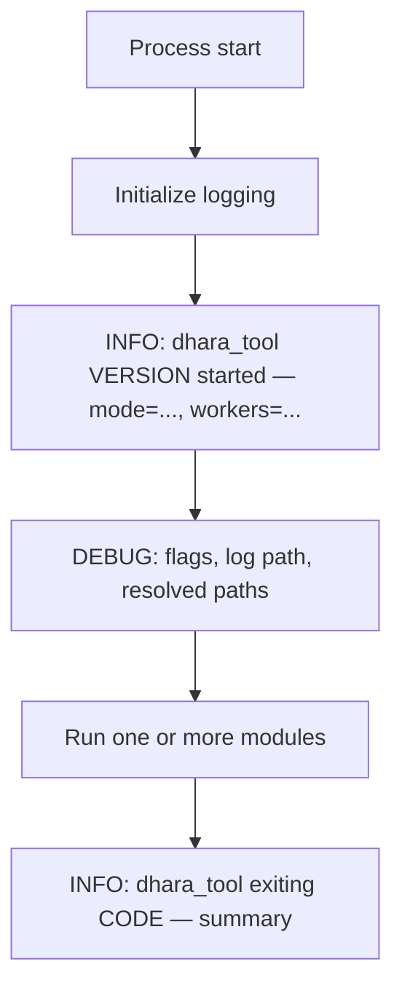
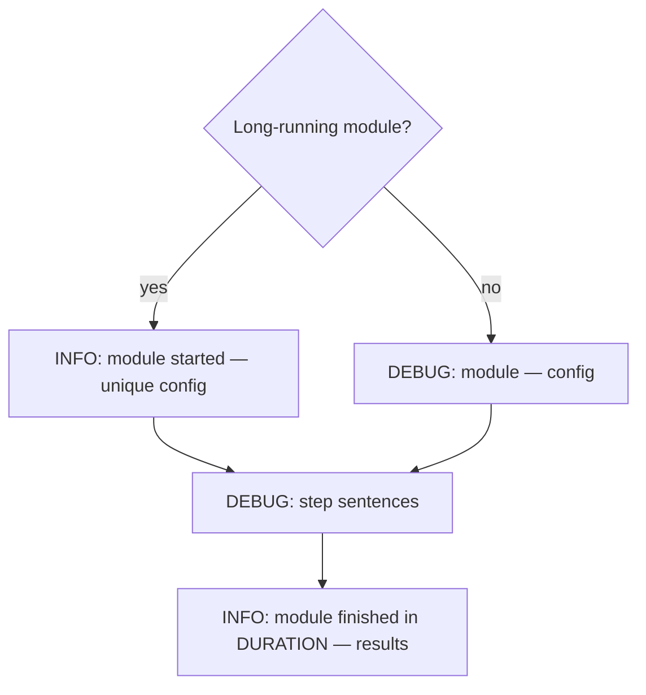

# Logging Conventions

This document describes how we write operator logs in Dhara Storage tooling. The conventions apply to `dhara_tool` today and serve as a reference for humans and AI agents working on any project in this workspace.

Logs are written for **humans and AI agents**, not log aggregators. Prefer plain sentences over JSON or field soup.

## Run modes

`dhara_tool` has two automatic run modes (not a manual flag):

| Mode | When | Console | Command stdout | File log |
|------|------|---------|----------------|----------|
| **direct** | Subcommand present (CI, agents, scripts) | INFO (level 3) | Structured report printed | INFO (level 3); WARN with `--min`; DEBUG with `--trace` |
| **interactive** | No subcommand in a TTY | INFO (level 3) | Captured in TUI panel | INFO (level 3); same file rules as direct |

## Worker threads

Parallel TrID parse/reduce uses a global Rayon pool initialized once at startup:

| Source | Precedence |
|--------|------------|
| `-w` / `--workers <n>` | Highest |
| `TOOL_MAX_WORKERS` env | Second |
| Default | 4 |

Effective threads = `min(available_parallelism - 1, configured cap)` (minimum 1). `RAYON_NUM_THREADS` is **ignored**.

Session INFO includes `workers={effective}`.

## Log files

- Directory: `tooling/logs/`
- Naming: `{date}_dhara_tool.log` (session 0), `{date}_dhara_tool_{n}.log` (session n > 0)
- Each process invocation allocates the next session file for that day.

## Log levels (`log` / `tracing` numeric scale)

Error=1, Warn=2, **Info=3**, Debug=4, Trace=5. A configured threshold captures that level and everything more severe.

| Mode | Console | File |
|------|---------|------|
| **Default** | 3 (INFO) | 3 (INFO) |
| **`--min` / `-m`** | 3 (INFO) | 2 (WARN) |
| **`--trace` / `-t`** | 3 (INFO) | 4 (DEBUG) |

Console stays at INFO for now; TUI-specific console policy will change later.

Default file log captures INFO audit lines. Use `--min` when only WARN+ should hit the file. Use `--trace` for DEBUG file detail (per-definition reduce trace, phase starts, flags/paths).

### INFO vs DEBUG matrix (TrID build)

| Category | INFO | DEBUG |
|----------|------|-------|
| **Performance** | Phase **finish** with duration (extract, parse, reduce, finalize) | Phase **start** (`phase {name} started`) |
| **Accuracy (reports)** | `TrID transform — …`; module finish summary | Per-definition reduce trace (`--trace` only) |
| **Environment** | `mode`, **effective worker count**, module begin args | `min`/`trace`, resolved paths, workspace snapshot, **log file path** |

**No reduce milestones** — `(N/total) reduce in progress` lines are not emitted at any level.

## Session lifecycle



### Session open (INFO)

One line with what matters to orient a reader:

```
dhara_tool 0.7.1 started — mode=direct, workers=4
```

Do **not** include the log file path on INFO (no self-reference).

### Session open detail (DEBUG)

```
flags min=no, trace=no, log=.../2026-06-27_dhara_tool_1.log
```

Resolved paths, non-default overrides, workspace snapshot.

### Session close (INFO)

Always on exit, success or failure:

```
dhara_tool exiting 0 at 2026-06-27T10:25:49.706Z — completed defs.inspect
dhara_tool exiting 1 at 2026-06-27T10:20:38.613Z — defs.inspect-trid-xml failed: ...
```

## Module lifecycle

A **module** is one command handler (e.g. `defs.inspect`, `verify.ci`, `package.pack`).



### Long-running modules

Full begin / phase timings / end with stats and duration:

- TrID build, inspect, and sync-embedded (`defs.build-trid-xml`, `defs.inspect-trid-xml`, `defs.sync-embedded`)
- CI verification (`verify.ci`)
- NuGet pack/verify/publish (`package.*`)
- Release (`release.run`)

Example (default mode):

```
INFO  dhara_tool 0.7.1 started — mode=direct, workers=4
INFO  defs.build-trid-xml started — defaults
INFO  phase extract finished in 15.4s — extracted archive
INFO  phase parse finished in 21.7s — parsed 21692 definitions
INFO  phase reduce finished in 2.1s — kept 5500 of 21692
INFO  phase finalize finished in 12ms — trimmed to 5500 definitions
INFO  TrID transform — parsed=21692, kept=5500, mime_corrected=258, ...
INFO  defs.build-trid-xml finished in 43.7s at ... — Output=..., Total Parsed=21692, Final Kept=5500
```

### Fast modules

Single INFO line at end (config at DEBUG only):

```
DEBUG defs.inspect — defaults
INFO  defs.inspect finished in 151ms at ... — Definitions=5500, Package Version=trid-2.00+dhbn.1
```

Rule of thumb: fewer than ~3 trivial steps and no heavy subprocess loop → compact finish.

## Console progress (direct mode)

When stderr is a TTY in direct mode, long TrID builds emit throttled progress on stderr:

```
parse: 1234/21692
reduce: 5500/21692
```

Interactive TUI mode does not show this progress yet (see `tui/exec.rs` TODO).

## TrID file audit policy

| Stage | Default file log | `--trace` file log |
|-------|------------------|-------------------|
| ExtractArchive | INFO phase finish only | DEBUG phase start + INFO finish |
| ParseDefinitions | INFO phase finish only (count/duration) | same (never per-file) |
| ReduceDefinitions | INFO phase finish + transform stats | DEBUG one line per definition (accept/reject + MIME detail) |
| FinalizePackage | INFO phase finish only | DEBUG phase start + INFO finish |

Console progress uses the same counters; file logs omit per-file parse lines entirely.

## Progress events (reduce trace, `--trace` only)

During TrID reduction with `--trace`, log **one fact per line** at DEBUG:

```
(5511/21692) BrainSuite Surface File Format — rejected: invalid MIME: application/x-foo
(4200/21692) Obscure Format — rejected: extension floodgate
(8000/21692) Empty Sig Type — rejected: no patterns
(1768/21692) PNG Image — accepted
(1234/21692) JPEG Image — accepted: fix: (application/octet-stream -> image/jpeg)
```

Do **not** repeat cumulative counters on every line. Emit aggregate stats **once** after reduce:

```
TrID transform — parsed=21692, kept=5500, mime_corrected=258, mime_rejected=343, ext_rejected=14764, sig_rejected=0, trimmed=1085
```

## Message templates (Rust / tracing)

Target: `dhara_tool::audit` for all audit events.

```rust
// Session
info!(target: "dhara_tool::audit", "dhara_tool {version} started — mode={mode}, workers={workers}");
debug!(target: "dhara_tool::audit", "flags min={min}, trace={trace}, log={path}");

// Phase timing
debug!(target: "dhara_tool::audit", "phase {name} started");
info!(target: "dhara_tool::audit", "phase {name} finished in {duration} — {summary}");

// Module begin (long)
info!(target: "dhara_tool::audit", "{module_id} started — {config_summary}");

// Module end
info!(target: "dhara_tool::audit", "{module_id} finished in {duration} at {timestamp} — {summary}");

// Failure
error!(target: "dhara_tool::audit", "{module_id} failed in {duration} at {timestamp} — {error}");
```

Language-agnostic equivalent: `{timestamp} {LEVEL} {scope}: {single human-readable sentence}`.

## Anti-patterns

| Bad | Good |
|-----|------|
| Duplicate stage lines from runner + defs callback | Single audit entry point in `defs/mod.rs` |
| `build progress stage=ReduceDefinitions current=5511 accepted=1768 ...` | `(5511/21692) BrainSuite Surface File Format — rejected: extension floodgate` (trace only) |
| `(1000/21692) reduce in progress` milestones | Phase finish INFO only |
| Log path on INFO session line | Log path on DEBUG only |
| Separate `logging initialized` + `command started` | One session open + one module begin |
| `--silent` to mean “no TUI” | Automatic `interactive` / `direct` run modes |
| INFO on every parsed XML file (21k lines) | INFO at parse phase finish only; console `(n/total)` throttled |

## Agent checklist

When diagnosing a run from logs alone:

1. Open the latest `tooling/logs/{date}_dhara_tool*.log` for today.
2. Find `dhara_tool ... started` — note mode and workers.
3. Find `{module} started` or `{module} finished` / `failed`.
4. For TrID work, grep `phase ` for timings and `TrID transform —` for final stats.
5. Read `dhara_tool exiting` for exit code and timestamp.
6. Use DEBUG sections only when INFO summary is insufficient (`--trace` for per-definition reduce detail).

Grep hints:

```
grep "started —" logfile
grep "phase " logfile
grep "finished in" logfile
grep "TrID transform" logfile
grep "exiting" logfile
```

## Related docs

- [dhara_tool README][readme-tool] — commands, flags, output layout
- [filedefs.dat / DSFD format][filedefs-dat] — TrID build phases referenced in audit logs
- [CI/CD pipelines][ci-cd] — direct mode in CI vs interactive TUI locally
- [Docs index][docs-index]

[readme-tool]: ../tooling/dhara_tool/README.md
[filedefs-dat]: filedefs-dat.md
[ci-cd]: ci-cd-pipelines.md
[docs-index]: README.md
