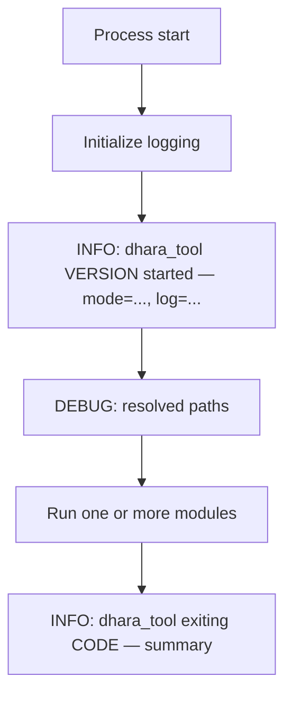
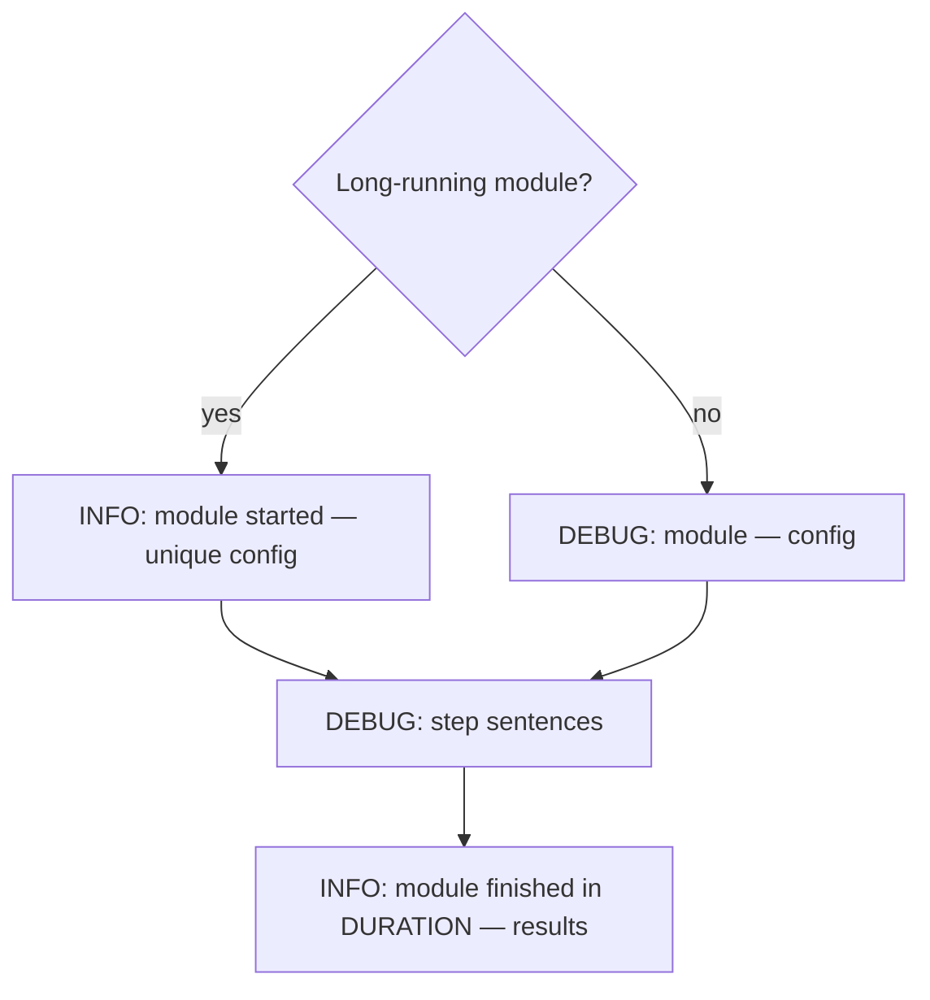

# Logging Conventions

This document describes how we write operator logs in Dhara Storage tooling. The conventions apply to `dhara_tool` today and serve as a reference for humans and AI agents working on any project in this workspace.

Logs are written for **humans and AI agents**, not log aggregators. Prefer plain sentences over JSON or field soup.

## Run modes

`dhara_tool` has two automatic run modes (not a manual flag):

| Mode | When | Console | Command stdout | File log |
|------|------|---------|----------------|----------|
| **interactive** | No subcommand in a TTY | Errors only (TUI owns the screen) | Captured in TUI panel | Full audit trail |
| **direct** | Subcommand present (CI, agents, scripts) | WARN/INFO/DEBUG per `-v` | Structured report printed | Full audit trail |

Use `-q` / `--quiet` in **direct** mode to suppress command stdout while keeping the file log.

## Log files

- Directory: `tooling/output/logs/`
- Naming: `{date}_dhara_tool.log` (session 0), `{date}_dhara_tool_{n}.log` (session n > 0)
- Each process invocation allocates the next session file for that day.

## Level policy

| Level | Use for |
|-------|---------|
| **INFO** | Session open/close, module begin/end, final statistics, warnings that affect outcome |
| **DEBUG** | Step detail: subprocess commands, per-object progress, file paths, intermediate decisions |
| **WARN** | Non-fatal issues: skipped steps, verification mismatches, update required |
| **ERROR** | Failures that stop the current module |

Default file log level: **INFO**. Use `-v` once for DEBUG on console and file; `-vv` for TRACE.

## Session lifecycle



### Session open (INFO)

One line with what matters to orient a reader:

```
dhara_tool 0.6.0 started — mode=direct, verbose=0, quiet=no, log=.../2026-06-27_dhara_tool_1.log
```

Do **not** emit a separate “logging initialized” event.

### Session open detail (DEBUG)

Resolved paths, non-default overrides, full argv when useful.

### Session close (INFO)

Always on exit, success or failure:

```
dhara_tool exiting 0 at 2026-06-27T10:25:49.706Z — completed defs.inspect
dhara_tool exiting 1 at 2026-06-27T10:20:38.613Z — defs.inspect-trid-xml failed: ...
```

## Module lifecycle

A **module** is one command handler (e.g. `defs.inspect`, `verify.ci`, `package.pack`).



### Long-running modules

Full begin / DEBUG steps / end with stats and duration:

- TrID build and inspect (`defs.build-trid-xml`, `defs.inspect-trid-xml`)
- CI verification (`verify.ci`)
- NuGet pack/verify/publish (`package.*`)
- Release (`release.run`)

Example:

```
INFO  defs.inspect-trid-xml started — defaults
DEBUG stage: load source — Loading source .../triddefs_xml.7z
DEBUG (5511/21692) BrainSuite Surface File Format — rejected: extension floodgate
INFO  TrID transform — parsed=21692, kept=5500, mime_corrected=258, ...
INFO  defs.inspect-trid-xml finished in 4m12s at ... — Final Kept=5500, Total Parsed=21692, ...
```

### Fast modules

Single INFO line at end (config at DEBUG only):

```
DEBUG defs.inspect — defaults
INFO  defs.inspect finished in 151ms at ... — Definitions=5500, Package Version=trid-2.00+dhbn.1
```

Rule of thumb: fewer than ~3 trivial steps and no heavy subprocess loop → compact finish.

## Progress events (object + outcome)

During TrID reduction, log **one fact per line** at DEBUG:

```
(5511/21692) BrainSuite Surface File Format — rejected: extension floodgate
(1768/21692) PNG Image — accepted
```

Do **not** repeat cumulative counters on every line (`accepted=1768 mime_corrected=51 ...`). Emit aggregate stats **once** at module end:

```
TrID transform — parsed=21692, kept=5500, mime_corrected=258, mime_rejected=343, ext_rejected=14764, sig_rejected=0, trimmed=1085
```

## Message templates (Rust / tracing)

Target: `dhara_tool::audit` for all audit events.

```rust
// Session
info!(target: "dhara_tool::audit", "dhara_tool {version} started — mode={mode}, verbose={verbose}, log={path}");

// Module begin (long)
info!(target: "dhara_tool::audit", "{module_id} started — {config_summary}");

// Module step
debug!(target: "dhara_tool::audit", "{message}");

// Module end
info!(target: "dhara_tool::audit", "{module_id} finished in {duration} at {timestamp} — {summary}");

// Failure
error!(target: "dhara_tool::audit", "{module_id} failed in {duration} at {timestamp} — {error}");
```

Language-agnostic equivalent: `{timestamp} {LEVEL} {scope}: {single human-readable sentence}`.

## Anti-patterns

| Bad | Good |
|-----|------|
| `build progress stage=ReduceDefinitions current=5511 accepted=1768 mime_corrected=51 ...` | `(5511/21692) BrainSuite Surface File Format — rejected: extension floodgate` |
| Separate `logging initialized` + `command started` + `starting defs command` | One session open + one module begin |
| Duplicate report fields logged in runner and command layer | Stats once at module end; stdout report separate |
| `--silent` to mean “no TUI” | Automatic `interactive` / `direct` run modes |
| INFO on every parsed XML file (21k lines) | DEBUG per object; INFO at stage boundaries and milestones |

## Agent checklist

When diagnosing a run from logs alone:

1. Open the latest `tooling/output/logs/{date}_dhara_tool*.log` for today.
2. Find `dhara_tool ... started` — note mode, verbose, log path.
3. Find `{module} started` or `{module} finished` / `failed`.
4. For TrID work, grep `TrID transform —` for final stats.
5. Read `dhara_tool exiting` for exit code and timestamp.
6. Use DEBUG sections only when INFO summary is insufficient.

Grep hints:

```
grep "started —" logfile
grep "finished in" logfile
grep "failed in" logfile
grep "TrID transform" logfile
grep "exiting" logfile
```

## Before / after example

**Before (avoid):**

```
INFO dhara_tool::audit: dhara_tool logging initialized log_path=... verbose=0 silent=false interactive=false
INFO dhara_tool::audit: command started command_id="defs.inspect-trid-xml" command="..." repo_root=... silent=false verbose=0
INFO dhara_tool::ops::trid: build progress stage=ReduceDefinitions ... accepted=1768 mime_corrected=51 extension_rejected=3626 ...
```

**After (target):**

```
INFO dhara_tool::audit: dhara_tool 0.6.0 started — mode=direct, verbose=0, quiet=no, log=.../2026-06-27_dhara_tool_2.log
INFO dhara_tool::audit: defs.inspect-trid-xml started — defaults
DEBUG dhara_tool::audit: stage: reduce definitions — Reducing validated definitions
DEBUG dhara_tool::audit: (5511/21692) BrainSuite Surface File Format — rejected: extension floodgate
INFO dhara_tool::audit: TrID transform — parsed=21692, kept=5500, ...
INFO dhara_tool::audit: defs.inspect-trid-xml finished in 4m12s at ... — Final Kept=5500, Total Parsed=21692
INFO dhara_tool::audit: dhara_tool exiting 0 at ... — completed defs.inspect-trid-xml
```
