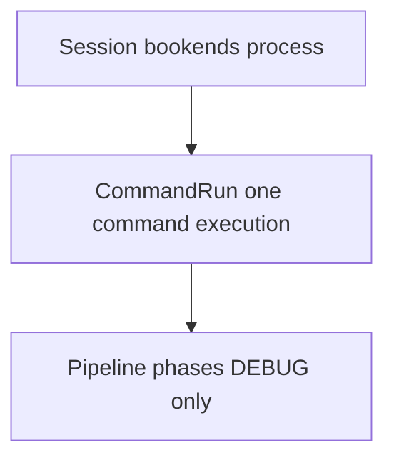
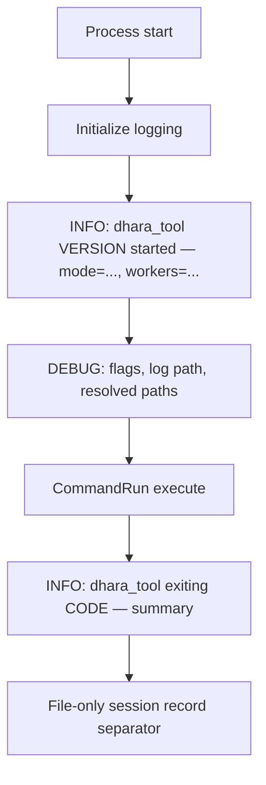
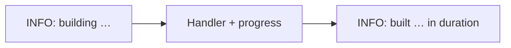

# Logging Conventions

This document describes how `dhara_tool` writes operator audit logs — for humans and AI agents diagnosing runs from plain-text files. Prefer one fact per line over JSON or field soup.

## Run modes

`dhara_tool` picks **direct** or **interactive** automatically (no manual flag):

| Mode | When | Console | Command stdout | File log |
|------|------|---------|----------------|----------|
| **direct** | Subcommand on the CLI (CI, scripts, agents) | TRACE (level 5) | Structured report printed | INFO (3); WARN with `--min`; DEBUG with `--trace` |
| **interactive** | No subcommand + graphical display (TUI) | OFF — WARN/ERROR routed to Troubleshooting panel | Captured in Terminal tab | INFO (3); same file rules as direct |

## Worker threads

Parallel TrID parse/reduce uses a global Rayon pool initialized once at startup:

| Source | Precedence |
|--------|------------|
| `-w` / `--workers <n>` | Highest |
| `TOOL_MAX_WORKERS` env | Second |
| Default | 4 |

Effective threads = `min(available_parallelism - 1, configured cap)` (minimum 1). `RAYON_NUM_THREADS` is **ignored**.

Session INFO includes `workers={effective}`.

## Log files

Generated operator logs live next to the running binary (`tool_root`), not under a fixed `tooling/` tree.

| Concept | Meaning |
|---------|---------|
| **`tool_root`** | Directory containing the `dhara_tool` executable (canonicalized). Default logs, artifacts, NuGet output. |
| **`repo_root`** | Dhara Storage workspace root (`dhara.config.toml` + `tooling/dhara_tool/Cargo.toml`). |

| Profile | Typical `tool_root` | Default log directory |
|---------|---------------------|------------------------|
| Dist / CI cache | `target/dist/` | `target/dist/logs/` |
| `cargo run` (dev) | `target/debug/` | `target/debug/logs/` |

- Directory: `{tool_root}/logs/` (override with `--logs-dir`; relative paths join `tool_root`)
- **One file per calendar day:** `{YYYY-MM-DD}_dhara_tool.log` — all process invocations that day **append** to the same file.
- After each process exit, a **file-only session record** (separator block) is appended for grep-friendly scanning between invocations.

Session DEBUG records `repo_root`, `tool_root`, `output_dir`, `logs_dir`, flags, and the log path.

## Log levels (`log` / `tracing` numeric scale)

Error=1, Warn=2, **Info=3**, Debug=4, Trace=5. A configured threshold captures that level and everything more severe.

| Sink | Default | `--min` / `-m` | `--trace` / `-t` |
|------|---------|----------------|------------------|
| **Direct console** | 5 (TRACE) | 5 (TRACE) | 5 (TRACE) |
| **Interactive console** | OFF | OFF | OFF |
| **File** | 3 (INFO) | 2 (WARN) | 4 (DEBUG) |

Default file log captures INFO audit lines. Use `--min` when only WARN+ should hit the file. Use `--trace` for DEBUG file detail (phase transitions, `TrID transform —`, per-definition reduce trace, paths).

## Three audit layers

Operator events are organized in three scopes:


```mermaid
flowchart TB
  session[Session bookends process]
  commandRun[CommandRun one command execution]
  phase[Pipeline phases DEBUG only]

  session --> commandRun
  commandRun --> phase
```

| Layer | Scope | INFO examples |
|-------|-------|---------------|
| **Session bookends** | Whole `dhara_tool` process | `dhara_tool … started`; `dhara_tool exiting …` |
| **Command run** | One registered command (`CommandRun` RAII) | `building definitions package…`; `built definitions package in 43.7s` |
| **Pipeline phase** | TrID sub-stages inside a long command | DEBUG only — `phase extract started` |

Timed duration on close belongs to the **command run**, not the session bookend.

## Session lifecycle


```mermaid
flowchart TD
  start[Process start] --> init[Initialize logging]
  init --> sessionOpen["INFO: dhara_tool VERSION started — mode=..., workers=..."]
  sessionOpen --> debugFlags["DEBUG: flags, log path, resolved paths"]
  debugFlags --> command[CommandRun execute]
  command --> sessionClose["INFO: dhara_tool exiting CODE — summary"]
  sessionClose --> record[File-only session record separator]
```

### Session open (INFO)

```
dhara_tool 0.9.0 started — mode=direct, workers=4
```

Do **not** include the log file path on INFO.

### Session close (INFO)

```
dhara_tool exiting 0 at 2026-07-03T10:25:49.706Z — completed defs.build-trid-xml
```

### Session record (file only)

Immediately after the close INFO line:

```
================================================================================
session end  exit=0  module=defs.build-trid-xml
================================================================================
```

## Command run lifecycle

Every command execution is wrapped in [`CommandRun`][command-run] (`logging/operation.rs`):


```mermaid
flowchart LR
  begin["INFO: building …"] --> work[Handler + progress]
  work --> complete["INFO: built … in duration"]
```

| Event | Level | Example |
|-------|-------|---------|
| Run started | INFO | `building definitions package…` |
| Run completed | INFO | `built definitions package in 43.7s` |
| Run completed + detail | INFO | `built definitions package in 43.7s — Definitions=12847` |
| Run failed | WARN | `definitions package build failed after 12.1s — archive tool missing` |

- Close lines **always** include duration (no threshold).
- No ISO timestamp on command close lines — duration is the operator-facing elapsed time.
- Command args / config are DEBUG when needed; not duplicated on INFO begin.

Example slice (defs build in direct mode):

```
INFO  dhara_tool 0.9.0 started — mode=direct, workers=4
INFO  building definitions package…
DEBUG phase extract started
DEBUG phase extract finished in 15.4s — extracted archive
DEBUG phase parse started
DEBUG TrID transform — parsed=21692, kept=5500, …
INFO  built definitions package in 43.7s — Output=..., Final Kept=5500
INFO  dhara_tool exiting 0 at … — completed defs.build-trid-xml
================================================================================
session end  exit=0  module=defs.build-trid-xml
================================================================================
```

## Interactive TUI activity

During a command run in interactive mode:

- INFO audit lines go to the **file only** (console is OFF).
- WARN/ERROR go to the **Troubleshooting** panel.
- The action panel **progress bar** and **status line** come from `ProgressSnapshot` via [`operation_progress`](../tooling/dhara_tool/crates/dhara_tool_kernel/src/operation_progress.rs). See [TUI operation progress](tui-progress.md) for the full lifecycle.
- Status priority: **active step detail** (`Parsing definitions (5000/21692)`) → analyzing message → command `activity_label` fallback.
- After **4 seconds** (`ELAPSED_UI_THRESHOLD`), elapsed time appends to the status line without overwriting step text.
- Long workflows (defs, quality, package, verify, release) install multi-step plans at runtime; short commands may jump straight to 100% on completion.

## Console progress (direct mode)

When stderr is a TTY in direct mode, long TrID builds emit throttled progress on stderr:

```
parse: 1234/21692
reduce: 5500/21692
```

## TrID file audit policy

| Stage | Default file log | `--trace` file log |
|-------|------------------|-------------------|
| ExtractArchive | DEBUG phase start/finish | same |
| ParseDefinitions | DEBUG phase start/finish | same (never per-file at INFO) |
| ReduceDefinitions | DEBUG phase finish + `TrID transform —` stats | DEBUG per-definition reduce trace |
| FinalizePackage | DEBUG phase start/finish | same |

**No reduce progress milestones** — `(N/total) reduce in progress` lines are not emitted at any level.

### Reduce trace (`--trace`, DEBUG)

```
(5511/21692) BrainSuite Surface File Format — rejected: invalid MIME: application/x-foo
(1768/21692) PNG Image — accepted
```

Aggregate stats once at DEBUG after reduce:

```
TrID transform — parsed=21692, kept=5500, mime_corrected=258, …
```

## Message templates (Rust / tracing)

Target: `dhara_tool::audit` for audit events.

```rust
// Session bookends
info!(target: "dhara_tool::audit", "dhara_tool {version} started — mode={mode}, workers={workers}");
info!(target: "dhara_tool::audit", "dhara_tool exiting {code} at {timestamp} — …");

// Command run (via CommandRun)
info!(target: "dhara_tool::audit", "building definitions package…");
info!(target: "dhara_tool::audit", "built definitions package in {duration} — {summary}");

// Pipeline phase
debug!(target: "dhara_tool::audit", "phase {name} started");
debug!(target: "dhara_tool::audit", "phase {name} finished in {duration} — {summary}");
debug!(target: "dhara_tool::audit", "TrID transform — parsed=…, kept=…, …");
```

## Anti-patterns

| Bad | Good |
|-----|------|
| Per-session log files (`_1.log`, `_2.log`) | One daily append file + session record separator |
| Phase finish at INFO in default runs | Phase detail at DEBUG; command run close at INFO |
| `TrID transform —` at INFO | DEBUG aggregate report |
| Log path on INFO session line | Log path on DEBUG only |
| `(N/total) reduce in progress` milestones | Throttled console counters; command run bookends |
| INFO on every parsed XML file | DEBUG phase finish; console `(n/total)` only |

## Agent checklist

When diagnosing from logs alone:

1. Open `{tool_root}/logs/{date}_dhara_tool.log` for today.
2. Find `dhara_tool … started` — note mode and workers.
3. Find command run open/close: `building …` / `built … in`.
4. For TrID depth, grep `phase ` and `TrID transform —` (DEBUG; need `--trace` run or default DEBUG visibility).
5. Read `dhara_tool exiting` and the following `session end` record.

Grep hints:

```
grep "started —" logfile
grep "building " logfile
grep "built " logfile
grep "phase " logfile
grep "TrID transform" logfile
grep "exiting" logfile
grep "session end" logfile
```

## Related docs

- [TUI operation progress][tui-progress] — progress bar lifecycle and per-command rollout
- [dhara_tool README][readme-tool] — commands, flags, output layout
- [filedefs.dat / DSFD format][filedefs-dat] — TrID build phases referenced in audit logs
- [CI/CD pipelines][ci-cd] — direct mode in CI vs interactive GUI locally
- [Docs index][docs-index]

[command-run]: ../tooling/dhara_tool/crates/dhara_tool_kernel/src/logging/operation.rs
[tui-progress]: tui-progress.md
[readme-tool]: ../tooling/dhara_tool/README.md
[filedefs-dat]: filedefs-dat.md
[ci-cd]: ci-cd-pipelines.md
[docs-index]: README.md
