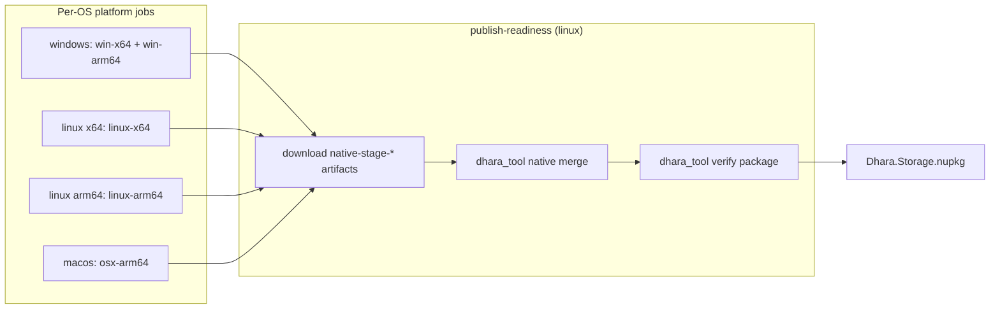

# Multi-platform native packaging

This document explains how Dhara Storage ships `dharastorage` native libraries inside the [Dhara.Storage][readme-nuget] NuGet package across five 64-bit runtime identifiers (RIDs). It covers per-host staging rules, CI artifact merge, MSBuild packing, and common failure modes discovered during the 0.8.0 pipeline rollout.

For job names and workflow triggers, see [CI/CD pipelines][ci-cd]. For operator commands, see [dhara_tool README][readme-tool].

## End-to-end flow



Each platform job runs `dhara_tool package stage-native` (with `--msvc-env` on Windows), uploads a `native-stage-{os}` artifact from `target/dist/artifacts/native-stage`, and exits. The `publish-readiness` job downloads all four artifacts, runs `native merge` into the same default stage directory, then `verify package` (no `--native-stage` when the merged tree matches the dist binary default).

## Expected layout

After merge, `target/dist/artifacts/native-stage` (dist `tool_root`) must contain:

```text
runtimes/
  win-x64/native/dharastorage.dll
  win-arm64/native/dharastorage.dll
  linux-x64/native/libdharastorage.so
  linux-arm64/native/libdharastorage.so
  osx-arm64/native/libdharastorage.dylib
```

`dhara_tool` validates this layout before `dotnet pack` ([`validate_staged_native_assets`][nuget-rs]) and again after pack by inspecting the `.nupkg` entry list ([`inspect_package_contents`][nuget-rs]).

## Which RIDs build on which host

`package stage-native` calls [`buildable_runtimes_on_host`][native-rids-rs], which filters `dhara.config.toml` `ci.native_runtimes` by **OS and CPU architecture**, not OS alone.

| Host | Buildable RIDs | Notes |
|------|----------------|-------|
| Windows x64 | `win-x64`, `win-arm64` | MSVC cross-compiles ARM64 from x64 |
| Windows arm64 | `win-arm64` | Native only |
| Linux x64 | `linux-x64` | **No** `linux-arm64` cross-compile |
| Linux arm64 | `linux-arm64` | **No** `linux-x64` cross-compile |
| macOS arm64 | `osx-arm64` | GitHub `macos-*` runners |

### Why Linux ARM64 needs its own CI job

`dharastorage` depends on `file_icon_provider`, which pulls GTK/glib through `pkg-config`. Cross-compiling `aarch64-unknown-linux-gnu` from `ubuntu-latest` fails when `glib-sys` cannot find a cross sysroot — even with `gcc-aarch64-linux-gnu` installed.

**Lesson:** treat `linux-arm64` like a separate platform job on `ubuntu-24.04-arm`, not as a cross-target from the x64 Linux job. The [pipeline][pipeline-yml] defines `platform-linux` (x64) and `platform-linux-arm64` (arm64) accordingly.

## Merging native artifacts

`publish-readiness` merges RID directories with `dhara_tool native merge` (paths are repo-relative):

```bash
dhara_tool native merge \
  --output target/dist/artifacts/native-stage \
  --input target/dist/artifacts/native-inputs/native-stage-windows \
  --input target/dist/artifacts/native-inputs/native-stage-linux \
  --input target/dist/artifacts/native-inputs/native-stage-linux-arm64 \
  --input target/dist/artifacts/native-inputs/native-stage-macos

dhara_tool verify package
```

Repeat `--input` once per downloaded artifact directory (each must contain a `runtimes/` folder). When the dist binary lives in `target/dist/`, `verify package` picks up `{tool_root}/artifacts/native-stage` by default — no `--native-stage` needed after merge.

## Packing staged natives into the NuGet

When `StagedNativeRoot` is set, [Dhara.Storage.csproj][csproj] skips local `cargo build` and injects prebuilt libraries during `Pack` via the `IncludeStagedNativeRuntimes` target (`BeforeTargets="_GetPackageFiles"`).

### Pass an absolute repository-root path

`dhara_tool` resolves relative `--native-stage` paths against the **repo root** before calling `dotnet pack` ([`absolute_native_stage_root`][nuget-rs]). `native merge` `--output` / `--input` paths use the same repo-root rule. MSBuild globs in the csproj are evaluated relative to the **project file**, not the working directory; pass an absolute `StagedNativeRoot` in local `dotnet pack` smoke tests.

### Use `_PackageFiles`, not static `ItemGroup`

Staged natives must be added in a `Pack` target as `_PackageFiles` with an explicit `PackagePath` derived from `MakeRelative` under `runtimes/`. A static `ItemGroup` with `%(RecursiveDir)` often fails to include merged CI assets even when files exist on disk.

### Local smoke test

```powershell
$stage = (Resolve-Path target/dist/artifacts/native-stage).Path
dotnet pack src/bindings/csharp/Dhara.Storage/Dhara.Storage.csproj `
  -c Release -p:StagedNativeRoot=$stage `
  --output target/dist/output/test-nuget
```

Inspect the nupkg for `runtimes/win-x64/native/dharastorage.dll` (and the other four RIDs). Packed release artifacts land in `target/dist/output/nuget/` when using the dist binary.

## Platform quirks (runtime and tests)

### macOS directory watch paths

FSEvents may report paths under `/private/var/...` while callers hold `/var/...` paths. [`normalize_watch_path`][watch-rs] canonicalizes paths when mapping `notify` events.

Directory watch integration tests should **poll for the created file path** after writing the file — macOS can emit a spurious create event for the parent directory first. Canonicalize the expected path **after** the file exists, not before.

## Troubleshooting checklist

| Symptom | Likely cause | Check |
|---------|--------------|-------|
| `staged native asset missing before pack` | Merge produced empty `native-stage` | Verify `native merge` inputs include `runtimes/` |
| `Tool vX not cached` on pipeline | `dhara-tool-build` not run for pinned version | Push tool changes to `development` with version bump |
| `glib-sys` / `pkg-config` cross error on Linux | Trying to build `linux-arm64` on x64 | Separate `platform-linux-arm64` job; see [native-rids.rs][native-rids-rs] |
| `No PR CI artifacts found for commit` on `main` release | Artifact SHA mismatch on merge commit | Merge commit (not squash); `publish-readiness` green on branch tip |
| macOS `directory_watch_reports_created_files` flake | Directory event before file event | Poll for file path; canonicalize after write |
| `cargo fmt` failure on PR | Unformatted Rust in touched crates | `cargo fmt -p dhara_storage_dal -p dhara_storage -p dharastorage-ffi -p dhara_tool` |

## Related docs

- [CI/CD pipelines][ci-cd] — workflow jobs, artifact names, CD reuse of PR artifacts
- [Logging conventions][logging] — `package.stage-native` and `verify.package` audit lines
- [dhara.config.toml][dhara-config] — `ci.native_runtimes` and rust target mappings

[readme-nuget]: ../src/bindings/csharp/Dhara.Storage/README.md
[ci-cd]: ci-cd-pipelines.md
[readme-tool]: ../tooling/dhara_tool/README.md
[tooling-scripts]: ../tooling/scripts/
[nuget-rs]: ../tooling/dhara_tool/crates/dhara_tool_ops/src/nuget.rs
[native-rids-rs]: ../tooling/dhara_tool/crates/dhara_tool_ops/src/native_rids.rs
[pipeline-yml]: ../.github/workflows/pipeline.yml
[tool-build-yml]: ../.github/workflows/dhara-tool-build.yml
[verify-local-sh]: ../tooling/scripts/verify-local.sh
[csproj]: ../src/bindings/csharp/Dhara.Storage/Dhara.Storage.csproj
[watch-rs]: ../src/core/dhara_storage/src/watch.rs
[logging]: logging.md
[dhara-config]: ../dhara.config.toml
