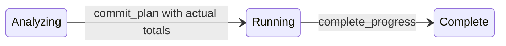
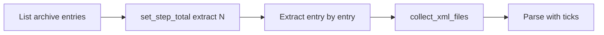

# TUI and interactive operation progress

This document describes how `dhara_tool` reports progress in the interactive TUI (and shares the same state machine with direct-mode stderr counters). It is written for agents and operators who need to extend workflows without relying on chat history.

## Problem this solves

Long-running commands previously showed a **0% bar until completion** because [`runner.rs`](../tooling/dhara_tool/crates/dhara_tool_cli/src/runner.rs) installed a placeholder `begin_single_shot("Running")` step that blocked real multi-step plans. Status text was often overwritten by generic command labels from [`CommandRun`](../tooling/dhara_tool/crates/dhara_tool_kernel/src/logging/operation.rs).

The fix is a **shared discover → commit → tick** lifecycle in [`operation_progress.rs`](../tooling/dhara_tool/crates/dhara_tool_kernel/src/operation_progress.rs), wired into defs, quality, package, verify, and release workflows.

## Lifecycle



| Phase | User sees | When |
| ----- | --------- | ---- |
| **Analyzing** | `Analyzing TrID source…`, `Planning quality checks…` | Totals not yet known |
| **Running** | Step label + `current/total`, bar moves | After `commit_plan()` |
| **Complete** | 100%, green bar | Runner calls `complete_progress()` on success |

**Percent formula** (unit-sum, not opaque weights):

```text
percent = sum(min(step.current, step.total)) / sum(step.total) * 100
```

Runtime totals come from measured work (file counts, enabled checks, RIDs to build) — not hardcoded budgets. Illustrative chat examples (e.g. 48,000 total units) were intent only.

## API cheat sheet (kernel)

| Function | Purpose |
| -------- | ------- |
| `begin_analyzing(msg)` | Indeterminate phase; clears steps |
| `plan_step(id, label, units)` | Register a stage |
| `set_step_total(id, total)` | Set discovered unit count |
| `commit_plan()` | Switch to determinate running |
| `tick_step(id, current)` | Advance stage |
| `set_step_message(id, detail)` | Status detail line |
| `complete_progress()` | Force 100% |
| `ProgressSession` | Thin RAII-style helper wrapping the above |
| `has_committed_progress_plan()` | True when a real multi-step plan is active |

**Ops helper:** [`workflow_progress.rs`](../tooling/dhara_tool/crates/dhara_tool_ops/src/workflow_progress.rs) — `begin_workflow`, `run_planned_step`, `run_workflow_step`.

### Rules for new workflows

1. Call `begin_analyzing` (or `begin_workflow`) before work when totals are unknown.
2. After discovery, `plan_step` + `set_step_total` with **actual** counts, then `commit_plan`.
3. Tick on stage boundaries (subprocess start/end, file batches) — **no stdout parsing** for percent.
4. If called nested inside a parent workflow, check `has_committed_progress_plan()` and skip installing a second plan (see `nuget::verify` / `nuget::publish`).

## Presentation layers

| Mode | Sink | Notes |
| ---- | ---- | ----- |
| **Interactive (TUI)** | `ProgressSnapshot` channel → [`action_panel.rs`](../tooling/dhara_tool/crates/dhara_tool_tui/src/widgets/action_panel.rs) | Do not draw `indicatif` to stderr (conflicts with ratatui) |
| **Direct CLI** | [`logging/progress.rs`](../tooling/dhara_tool/crates/dhara_tool_kernel/src/logging/progress.rs) throttled stderr | TrID counters on TTY |

Status line priority in the TUI:

1. Active step `detail` or `label (current/total)`
2. `analyzing_message` while analyzing
3. Command `activity_label` + elapsed (fallback for short commands)

The action panel title is fixed (`Actions`); it does not change per command.

Elapsed seconds (after 4s) append to the step line without clobbering stage text. Elapsed is computed from `install_run_clock` on the **worker thread** when each snapshot is published — there is no background reporter thread.

**Status line copy** stays short (not audit-log prose): extract/finalize use fixed phrases without counts; parse and reduce keep `(current/total)`; completion summaries (`Parsed N in …`, `trimmed to N`, `kept X of Y`) stay in file logs only.

## Status flicker fix (thread-local plan)

`OperationPlan` lives in a **`thread_local!`** slot in [`operation_progress.rs`](../tooling/dhara_tool/crates/dhara_tool_kernel/src/operation_progress.rs). A prior `ElapsedActivityReporter` spawned a background thread that called `publish_snapshot()` every second on that thread’s **empty** plan, alternating the TUI between the command milestone (`building definitions package…`) and real step text (`Parsing definitions (N/M)`).

Fix:

1. Removed the background reporter; [`CommandRun`](../tooling/dhara_tool/crates/dhara_tool_kernel/src/logging/operation.rs) calls `install_run_clock` on the worker thread only.
2. `elapsed_secs` is derived in `snapshot_from_plan` from the worker-thread clock — not stored on the plan or updated from another thread.
3. [`progress.rs`](../tooling/dhara_tool/crates/dhara_tool_kernel/src/logging/progress.rs) no longer calls `set_run_activity` on TrID phase changes; the committed step plan owns status text.

Do not publish progress snapshots from helper threads unless they also own the plan (they should not).

## Per-command rollout

| Command | Status | Steps (examples) |
| ------- | ------ | ---------------- |
| `defs.build-trid-xml` | **Reference** | extract → parse (`xml_files.len()`) → reduce → finalize |
| `defs.inspect-trid-xml` / `defs.sync-embedded` | Same TrID path | Same |
| `quality.run` | Wired | fmt, clippy, doc?, test-rust, test-dotnet? |
| `quality.fmt` / `clippy` / `doc` / `test-*` | Wired (standalone single step) | One step each |
| `package.pack` | Wired | stage-native (per RID), dotnet-pack, inspect |
| `package.stage-native` | Wired | stage-native (per RID) |
| `verify.package` | Wired | pack, restore-smoke, run-smoke, reject-check, aot-restore, aot-publish |
| `package.publish` | Wired | verify, optional push |
| `release.run` | Wired | validate, cargo-release?, nuget-release |
| `native.merge`, fast defs, config | Skip | Too short for meaningful bar |

## Defs / TrID worked example

1. **Load source** → `begin_analyzing("Analyzing TrID source…")`
2. **Analyze archive** → `Analyzing archive …` while entry count is discovered
3. **Extract archive** → step `extract`, total = archive entry count; ticks every 50 entries via [`sevenz-rust`](https://docs.rs/sevenz-rust) in [`source.rs`](../tooling/dhara_tool/crates/dhara_tool_kernel/src/filedefs/trid/source.rs). Falls back to `tar -xf` (indeterminate `0/1`) when sevenz fails.
4. **Enumerate XML files** → `Reading definition files (N found)` then `set_step_total("parse", N)` and same for `reduce`
5. **Parse** → `tick_step` every 250 files (sequential and parallel via `emit_trid_progress`)
6. **Reduce / finalize** → throttled ticks with survivor detail



Parallel parse uses thread-safe `emit_trid_progress` (mutex in dispatch) instead of `FnMut` callbacks from worker threads.

## File map

| File | Role |
| ---- | ---- |
| [`operation_progress.rs`](../tooling/dhara_tool/crates/dhara_tool_kernel/src/operation_progress.rs) | Plan state, snapshot, `ProgressSession` |
| [`workflow_progress.rs`](../tooling/dhara_tool/crates/dhara_tool_ops/src/workflow_progress.rs) | Ops step helpers |
| [`runner.rs`](../tooling/dhara_tool/crates/dhara_tool_cli/src/runner.rs) | `OperationProgressGuard`; no placeholder plan |
| [`operation.rs`](../tooling/dhara_tool/crates/dhara_tool_kernel/src/logging/operation.rs) | `CommandRun`; elapsed without clobbering steps |
| [`progress.rs`](../tooling/dhara_tool/crates/dhara_tool_kernel/src/logging/progress.rs) | TrID dispatch + direct stderr |
| [`source.rs`](../tooling/dhara_tool/crates/dhara_tool_kernel/src/filedefs/trid/source.rs) | sevenz extract ticks, enumerate message, parallel parse ticks |
| [`quality.rs`](../tooling/dhara_tool/crates/dhara_tool_ops/src/quality.rs) | Quality workflow steps |
| [`nuget.rs`](../tooling/dhara_tool/crates/dhara_tool_ops/src/nuget.rs) | Pack / verify / publish / stage-native |
| [`release.rs`](../tooling/dhara_tool/crates/dhara_tool_ops/src/release.rs) | Release workflow steps |
| [`action_panel.rs`](../tooling/dhara_tool/crates/dhara_tool_tui/src/widgets/action_panel.rs) | Bar + status rendering |

## Deferred

- Byte-level progress within a single compressed 7z stream (solid blocks); entry-level is the practical unit
- `tar` fallback extract remains indeterminate (`0/1`) when sevenz-rust cannot open the archive
- Parsing cargo/dotnet stdout for fine-grained percent
- [`indicatif`](https://docs.rs/indicatif) on stderr in direct mode (spinner → bar pattern)
- Per-stage bar reset (0–100% each stage) as optional UX
- Duration-based weight estimates before enumeration

## Related

- [Logging conventions](logging.md) — audit tiers and TrID phase lines
- [Workspace architecture](architecture.md) — tool crate DAG and TUI layout
- [AGENTS.md](../AGENTS.md) — local verify commands
